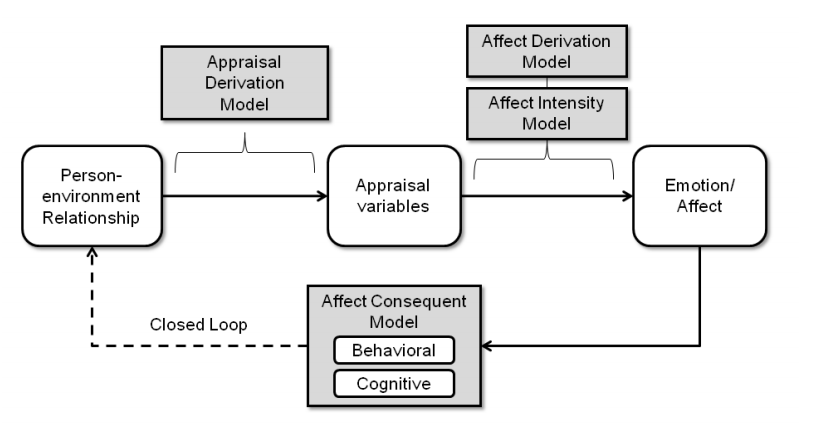

# Computational model of emotion

1. [Marsella, S. & Gratch, J. Computational Models of Emotion. Chapter to be published in Scherer, K.R., Bänziger, T., & Roesch, E. (Eds.) A blueprint for an affectively competent agent: Cross-fertilization between Emotion 
Psychology, Affective Neuroscience, and Affective Computing. Oxford: Oxford University Press, in press](http://people.ict.usc.edu/~marsella/publications/MarGraPet_Review.pdf)

## Appraisal theory

Appraisal theorists typically view appraisal as the cause of emotion, or at least of the physiological, behavioral and cognitive changes associated with emotion. 

Indeed, although appraisal theorists allow that the same situation may elicit multiple appraisals, theorists are relatively silent on how these individual appraisals would combine into an overall emotional state or if this state is best represented by discrete motor programs 
or more dimensional representations. More recent work has begun to examine the processing 
constraints underlying appraisal – to what extent is it parallel or sequential (Moors et al., 2005, Scherer, 
2001)? does it occur at multiple levels (Scherer, 2001, Smith and Kirby, 2000)? – and creating a better 
understanding of the cognitive, situational and dispositional factors that influence appraisal judgments 
(Smith and Kirby, 2009, Kuppens and Van Mechelen, 2007).

## Dimensional Theories 

Many computational dimensional models build on the three-dimensional “PAD” 
model of Mehrabian and Russell (1974) where these dimensions correspond to pleasure (a measure of 
valence), arousal (indicating the level of affective activation) and dominance (a measure of power or 
control). 

Dimensional theorists conceive of core affect as a “non-intentional” state, meaning the affect 
is not about some object (as in “I am angry at him). In such theories, many factors may contribute to a 
change in core affect including symbolic intentional judgments (e.g., appraisal) but also sub-symbolic 
factors such as hormones and drugs (Schachter and Singer, 1962), but most importantly, the link 
between any preceding intentional meaning and emotion is broken (as it is not represented within core 
affect) and must be recovered after the fact, sometimes incorrectly (Clore and Plamer, 2009, Clore et al., 
1994).

Interestingly, we are not aware of any computational models that follow the 
suggestion from Zajonc and Russell that appraisal is a post hoc explanation of core affect. Rather, many 
computational models of emotion that incorporate core affect have viewed appraisal as the mechanism 
that initiates changes to core affect. For example Gebhard’s (2005) ALMA model includes Ortony, Clore 
and Collins (1988) inspired appraisal rules and WASABI (Becker-Asano and Wachsmuth, 2008) 
incorporates appraisal processes inspired by Scherer’s sequential-checking theory into a PAD-based 
model of core affect. Some computational models explore how core affect can influence cognitive 
processes. For example, HOTCO 2 (Thagard, 2003) allow explanations to be biased by dimensional affect 
(in this case, a one-dimensional model encoding valence) but this is more naturally seen as the 
consequence of emotion on cognition (e.g., the modeling of an emotion-focused coping strategy in the 
sense of Lazarus, 1991). 

## Anatomic approaches:

Computational models inspired by the anatomic tradition often focus on low-level 
perceptual-motor tasks and encode a two-process view of emotion that argues for a fast, automatic, 
undifferentiated emotional response and a slower, more differentiated response that relies on higherlevel reasoning processes (e.g., Armony et al., 1997). 

## Rational approaches

AI and logic based.

## Component models

## Processing Assumptions

### Representational Specificity

whereas others further decompose appraisal 
checks into the representational details (e.g., domain propositions, actions, and the causal relationships 
between them) that are necessary for an agent to appraise its relationship to the environment (e.g., El 
Nasr et al., 2000, Gratch and Marsella, 2004a, Neal Reilly, 1996, Si et al., 2008, Mao and Gratch, 2006, 
Dias and Paiva, 2005, Becker-Asano, 2008).

Sander and colleagues (2005) provide a detailed neural network model of how appraisals are derived from the 
person-environment relationship, but the person-environment relationship itself is only abstractly 
represented. 

### Domain specific vs. Domain independent
Computational appraisal models differ in terms 
of how domain-specific knowledge is encoded and which components require domain-specific  input. 
Most systems incorporate domain-independent affect-derivation models (Marinier, 2008, Becker-Asano, 
2008, Gratch and Marsella, 2004a, Gebhard, 2005, Neal Reilly, 1996, Bui, 2004). Fewer systems provide 
domain-independent algorithms for appraisal-derivation (e.g., Gratch and Marsella, 2004a, Neal Reilly, 
1996, Si et al., 2008, El Nasr et al., 2000).  