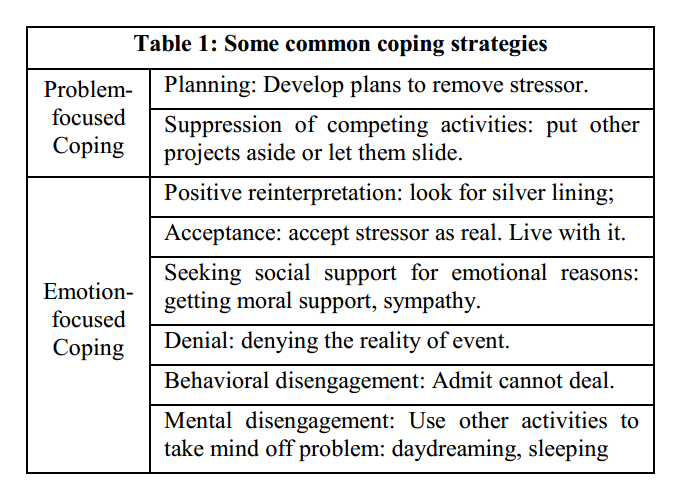
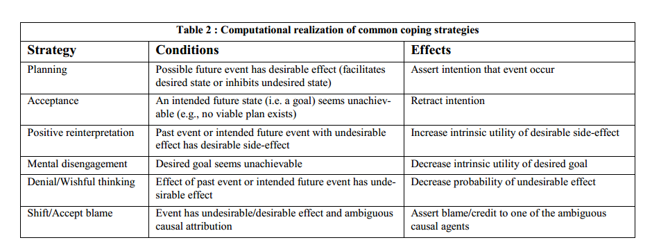

#Modelling coping behaviour 

[Article by Marsella and Gratch](http://people.ict.usc.edu/~gratch/MarsellaGratch-aamas03.pdf)
Based on Smith  and  Lazarus work:  

* *C.  Smith  and  R.  Lazarus.,  "Emotion  and  Adaptation,"  in Handbook  of  Personality:  theory  &  research,  Pervin,  Ed. NY: Guilford Press, 1990, pp. 609-637.*

# Appraisal and appraisal variables

*  goal  relevance  –  are  the  consequences  of  an  event  relevant to an organism’s goals
*  desirability – how desirable are the consequences
*  likelihood – how likely are the consequences
*  causal  attribution  –  who  is  the  causal  agent  underlying  the event and do they deserve credit or blame
*  coping potential – a measure of an agent’s ability to reverse negative or maintain positive circumstances.

[Scherer has much more interesting appraisal variables.](scherer_appraisal.md) 

# Coping

## Model of Appraisal

Events  are  represented  as  probabilistic  STRIPS  operators. 

## A MODEL OF COPING

See [M.Minsky The emotion machine: What are some useful “Ways to Think?”](http://web.media.mit.edu/~minsky/E7/eb7.html).

The selection of a coping strategy is a four-stage process: 

1. identify a  coping  opportunity,  
2. propose  alternative  coping  strategies, 
3. assess coping potential, 
4. select a strategy to apply.

### Identify coping opportunity:

1. Focus agency
1. Interpretation - objects
1. Agency - max
1. Max - interpretation
1. Potential responsibility 
