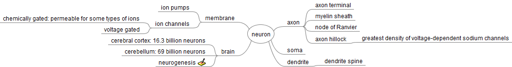

#Neuron analysis

##Other types of neurons

* Basket cells, interneurons that form a dense plexus of terminals around the soma of target cells, found in the cortex and cerebellum.
* Betz cells, large motor neurons.
* Lugaro cells, interneurons of the cerebellum.
* Medium spiny neurons, most neurons in the corpus striatum.
* Purkinje cells, huge neurons in the cerebellum, a type of Golgi I multipolar neuron.
* Pyramidal cells, neurons with triangular soma, a type of Golgi I.
* Renshaw cells, neurons with both ends linked to alpha motor neurons.
* Unipolar brush cells, interneurons with unique dendrite ending in a brush-like tuft.
* Granule cells, a type of Golgi II neuron.
* Anterior horn cells, motoneurons located in the spinal cord.
* Spindle cells, interneurons that connect widely separated areas of the brain

##IPSP

https://en.wikipedia.org/wiki/Inhibitory_postsynaptic_potential

In general, a postsynaptic potential is dependent on the type and combination of receptor channel, reverse potential of the postsynaptic potential, action potential threshold voltage, ionic permeability of the ion channel, as well as the concentrations of the ions in and out of the cell; this determines if it is excitatory or inhibitory. IPSPs always want to keep the membrane potential more negative than the action potential threshold and can be seen as a “transient hyperpolarization”.[3] EPSPs and IPSPs compete with each other at numerous synapses of a neuron; this determines whether or not the action potential at the presynaptic terminal will regenerate at the postsynaptic membrane. Some common neurotransmitters involved in IPSPs are GABA and glycine.

#EPSP

https://en.wikipedia.org/wiki/Excitatory_postsynaptic_potential

In neuroscience, an excitatory postsynaptic potential (EPSP) is a temporary depolarization of postsynaptic membrane potential caused by the flow of positively charged ions into the postsynaptic cell as a result of opening of ligand-gated ion channels. They are the opposite of inhibitory postsynaptic potentials (IPSPs), which usually result from the flow of negative ions into the cell or positive ions out of the cell. A postsynaptic potential is defined as excitatory if it makes the neuron more likely to fire an action potential. EPSPs can also result from a decrease in outgoing positive charges, while IPSPs are sometimes caused by an increase in positive charge outflow. The flow of ions that causes an EPSP is an excitatory postsynaptic current (EPSC).

EPSPs, like IPSPs, are graded (i.e. they have an additive effect). When multiple EPSPs occur on a single patch of postsynaptic membrane, their combined effect is the sum of the individual EPSPs. Larger EPSPs result in greater membrane depolarization and thus increase the likelihood that the postsynaptic cell reaches the threshold for firing an action potential.

#Action potential

https://en.wikipedia.org/wiki/Action_potential

In physiology, an action potential is a short-lasting event in which the electrical membrane potential of a cell rapidly rises and falls, following a consistent trajectory. Action potentials occur in several types of animal cells, called excitable cells, which include neurons, muscle cells, and endocrine cells, as well as in some plant cells. In neurons, they play a central role in cell-to-cell communication. In other types of cells, their main function is to activate intracellular processes. In muscle cells, for example, an action potential is the first step in the chain of events leading to contraction. In beta cells of the pancreas, they provoke release of insulin.[1] Action potentials in neurons are also known as "nerve impulses" or "spikes", and the temporal sequence of action potentials generated by a neuron is called its "spike train". A neuron that emits an action potential is often said to "fire"
