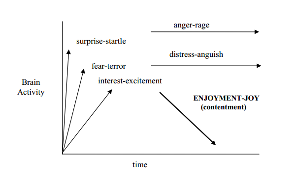

# Primary affect psychology analysis

Analysis of http://www.tomkins.org/uploads/Primer_of_Affect_Psychology.pdf

1. Part of normal brain function evolved to reduce stimulus confusion. 
1. Nothing becomes conscious unless an affect is triggered first. 
1. Each affect is triggered by a specific stimulus condition or pattern. 
1. Affect is information about stimulus conditions. 
1. Positive affect is inherently rewarding,negative affect inherently punishing. 
1. The NINE innate affects—POSITIVE * NEUTRAL * NEGATIVE—are:
  1. Surprise (neutral)
  1. Interest (positive)
  1. Joy (positive)
  1. Fear (negative)
  1. Distress (negative)
  1. Anger (negative)
  1. Disgust (negative)
  1. Dissmell (negative)
  1. Shame (negative)
