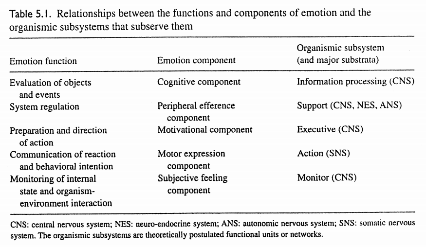
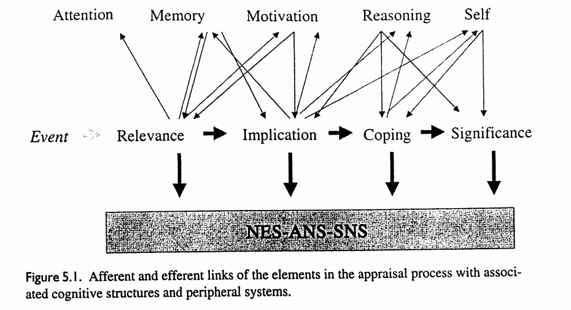
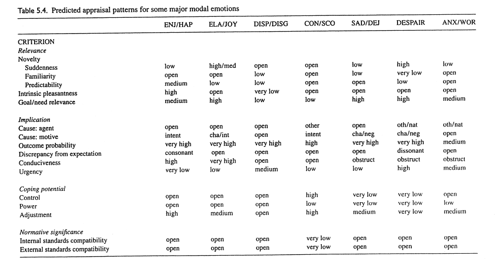
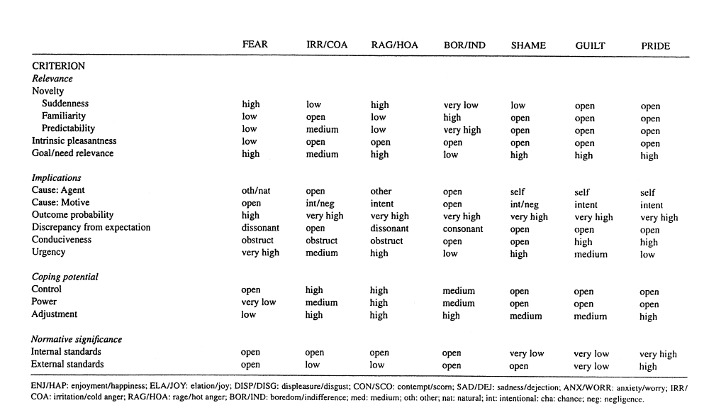

#Appraisal considered as processes of multilevel sequential checking
Klaus Scherer.

* *Roseman & Smith in Appraisal processes in emotion: Theory, Methods, Research. New York and Oxford: Oxford University Press.*

SECs - stimulus evaluation checks.

1. Relevance.
1. Implications.
1. Coping potential.
1. Normative significance. What is significance of this event with respect to my self-concept and to social norms and values?

## Relevance detection

1. Novelty check. (-> interest/surprise)
1. Intrinsic pleasantness check. (joy -> sadness) 
1. Goal relevance. (?)

## Implication assessment

1. Causal Attribution check: *Weiner, 1985* (originator attachment) 
1. Outcome probability check.
1. Discrepancy from expectation check.
1. Goal/need conduciveness check. (frustration). Conduciveness is orthogonal to expectation. (love -> remorse)
1. Urgency check. (-> anger/fear)

## Coping potential determination

1. Control check.
1. Power check. (fight or flight). (anger -> fear)
1. Adjustment check. ()

## Normative significance evaluation

1. Internal standards check. (trust -> disgust)
1. External standards check.

## The appraisal process

## Similarity analysis of emotional labels

