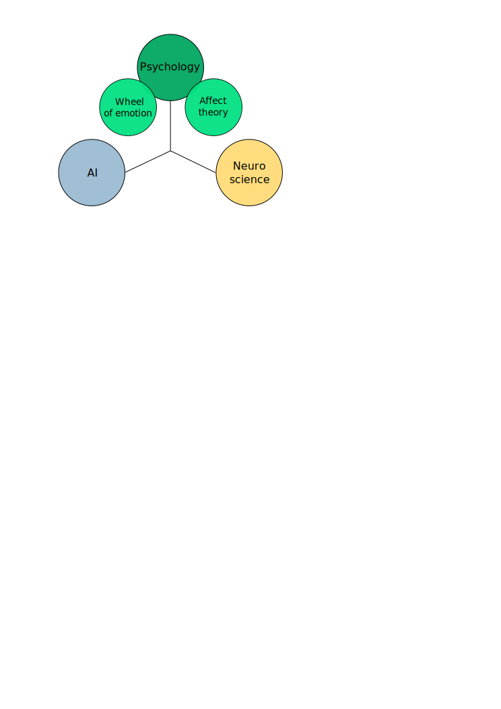

#Artificial emotions and appraisal aspects

##Introduction

Latest biggest neural network was build by RIKEN and contains 1.73 billion nerve cells connected by 10.4 trillion synapses [Riken]. Their simulation represented only 1 percent of brain. We still far away from really functional model of the brain, especially taking in account the energy it consumed and the place it occupied. There are other team that promise to create the new base for the electronic simulations of brain: IBM initiative SyNAPSE [SyNAPSE]. This initiatives crates background and demands proper theoretical basis for new thinking machines.
Recently the scientific interest to emotional aspect of thinking raised in following domains: neuro-scientists [emotionsbraintorobot, parsingreward, neuromodulatory, cubeofemotions, natureofemotions], computer science [emotionandsociable, senticcomputing, hourglass, affectivemodelofinterplay, affectivecomputing]. Although there are still only several computational emotions models created[computationalmodelsemotion, computationalmodelsemotionscognition, evaluatingcomutationalmodel, threelevel] and no computational emotion thinking.
Rosalind Picard in her article [affectivecomputingchallanges] stated: "There may exist a kind of alien intelligent living system, something we’ve never encountered, which achieves its intelligence without having anything like emotion. Although humans are the most marvellous example of intelligence we have, and we wish to build systems that are natural for humans to understand, these reasons for building human-like systems should not limit us to thinking only of human abilities." Unfortunately there is no example of unemotional intelligence and seems to be inseparable part of human thinking. Marvin Minsky by means of his book "The emotion machine" [emotionmachine] created framework for the emotional artificial intelligence emphasizing the role of emotions in human thinking and common sense logic. Robert Plutchik describing the model of emotions in [natureofemotions] states that emotions evolved through years and became important part of cognitions, behavior and mind - "What we call cognition - the activity of knowing, learning and thinking, of which emotion is a part—evolved over millions of years. Charles Darwin recognized that the process of evolution by natural selection applied not only to anatomic structures but also to an animal’s "mind" and expressive behavior-a conclusion that led him to write a book on emotional expression."
This article is dedicated to our hypothesis of computational emotional thinking approach and reflection of neuro-scientific model to computational processes of modern computers.
We suppose that it could be considered as base of computational emotional thinking framework and could be useful in several domains:

1. Advertisement
1. Emotional behavior simulations
1. Robotics
1. Intellectual assistants
1. Estimating human behaviour
1. Nursing software and robotics.

##Cognitive bases

##Emotional processes

##Neuromodulatory bases of emotions

##Neuromodulators to computing system parameters mapping

##Appraisal aspects
###Non-conscious appraisal
###Conscious appraisal
##High level emotions mapping to neuromodulators
##Conclusion

