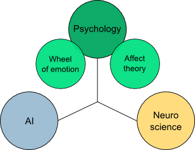
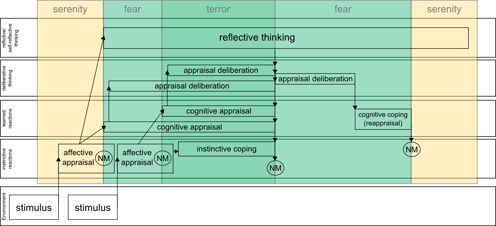
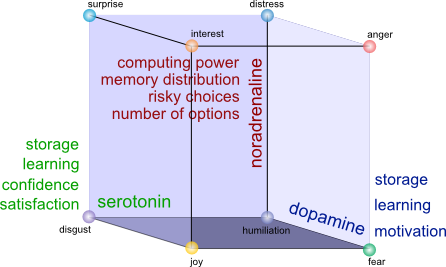

#Artificial high level and low level emotions

##Introduction

Latest biggest neural network was build by RIKEN and contains 1.73 billion nerve cells connected by 10.4 trillion synapses [Riken]. Their simulation represented only 1 percent of brain. We still far away from really functional model of the brain, especially taking in account the energy it consumed and the space it occupied. There are other teams that promise to create the new base for the electronic simulations of brain: IBM initiative SyNAPSE [SyNAPSE], Neurogrid [Neurogrid]. This initiatives crates background and demands proper theoretical basis for new thinking machines.
Recently the scientific interest to emotional aspect of thinking raised in following domains: neuro-scientists [emotionsbraintorobot, parsingreward, neuromodulatory, cubeofemotions, natureofemotions, putting_appraisal_in_context, anatomic], computer science [emotionandsociable, senticcomputing, hourglass, affectivemodelofinterplay, affectivecomputing, dont_worry_be_happy, hourglass, senticcomputing, parsingreward, emotionsbraintorobot, motivationalrewardframework, roleofemotions]. Although there are still only several computational emotions models created[computationalmodelsemotion, computationalmodelsemotionscognition, evaluatingcomutationalmodel, threelevel] and no computational emotion thinking.
Rosalind Picard in her article [affectivecomputingchallanges] stated: "There may exist a kind of alien intelligent living system, something we’ve never encountered, which achieves its intelligence without having anything like emotion. Although humans are the most marvellous example of intelligence we have, and we wish to build systems that are natural for humans to understand, these reasons for building human-like systems should not limit us to thinking only of human abilities." Unfortunately there is no example of unemotional intelligence and seems to be inseparable part of human thinking. Marvin Minsky in his book "The emotion machine" [emotionmachine] created framework for the emotional artificial intelligence emphasizing the role of emotions in human thinking. Robert Plutchik describing the model of emotions in [natureofemotions] states that emotions evolved through years and became important part of cognitions, behavior and mind - "What we call cognition - the activity of knowing, learning and thinking, of which emotion is a part—evolved over millions of years. Charles Darwin recognized that the process of evolution by natural selection applied not only to anatomic structures but also to an animal’s "mind" and expressive behavior-a conclusion that led him to write a book on emotional expression."
This article is dedicated to our hypothesis of computational emotional thinking approach and reflection of neuro-physiological model on computational processes of modern computers, and mainly it is answer to the question: can machines actually feel the emotions.
We suppose that it could be considered as base of computational emotional thinking framework and could be useful in several domains:

1. Advertisement
1. Emotional behavior simulations
1. Robotics
1. Intellectual assistants
1. Estimating human behaviour
1. Nursing software and robotics.

##Cognitive bases

We use three main bases for our hypothesis: evolution psychology: Plutchik [natureofemotions] as psychological overall picture of emotions, neuroscience: Lovheim [cubeofemotions] model of emotions based on monoamines levels (neuromodulators), we encapsulate all this in cognitive architecture created by Marvin Minsky and described in his book [emotionmachine].

Minsky indicates 6 levels of metal activities that collaborate and intersect one with neighbor:

1. Instinctive reactions
1. Learned reactions
1. Deliberative thinking
1. Reflective thinking
1. Self-reflective thinking
1. Self-conscious thinking

We suppose that all this neuro-physiological mechanisms could be expressed in terms of mental activities and implemented over realistic neural network.

###Emotional processes

Plutchik identified emotional processes as feedback loops [natureofemotions] that support homeostasis of the system. We mapped them on Marvin Minsky "Model of six" in the following way:

This is picture depicts switches of the emotional state of the system from serenity to fear then to terror, then back to fear and serenity. Colors of emotional states matches colors of basic emotions from "Wheel of emotion" [natureofemotions]. First stimulus triggers affective appraisal which as the part of it invokes neuromodulation and neuromodulation actually switches the emotional state from serenity to fear. First affective appraisal triggers cognitive appraisal and reflective thinking, cognitive appraisal initiates appraisal deliberation. Second stimulus triggers second affective appraisal and this appraisal in its turn triggers cognitive appraisal and second appraisal deliberation. Second neuromodulation switches the emotional state of the system from fear to terror. Second affective appraisal triggers instinctive coping also.  Later reflective thinking analyzing the appraisal processes going on in the system, decides to stop all of them, including instinctive coping, consider them as irrelative and initiates one new appraisal deliberation process and neuromodulation that switches emotional state of the system from terror to fear. The system considers situation not that frightening as it seems according to second stimulus. Third appraisal deliberation initiates cognitive coping(reappraisal), that in its turn triggers neuromodulation that returns system to serenity.

This is an example of primitive emotional processes that could happen in everyday life during some minutes starting from frightening stimulus to reappraisal that triggers emotional state back to serenity.

As we mentioned earlier, the primary goal of this research is to construct framework that would be capable of feeling emotions, rather than just simulating them. We have started from classifications of emotions, this actually leads us to the evolutionary psychology theory by Robert Plutchik [natureofemotions]. His theory combines elegance of three dimensional model with completeness. It takes in account the power of emotions and their nature including basic and complex high level emotions (feelings). Plutchik determined eight basic emotions grouped in four pairs:

1. Joy - sorrow
1. Anger - fear
1. Acceptance - disgust
1. Surprise - expectancy

High level emotions are mixtures of two or more basic emotions:

1. Love = joy + acceptance
1. Submission = acceptance + fear
1. Awe = fear + surprise
1. Disapproval = surprise + sorrow
1. Remorse = sorrow + disgust
1. Contempt = disgust + anger
1. Aggressiveness = anger + expectancy
1. Optimism = expectancy + joy

###Neuromodulatory bases of emotions

Gaining this complete picture of human emotions, we still lack the mechanism of the emotional influence on thinking processes of human, in different words, the low level mechanism that defines the way emotional state alters the computational processes of a system.

The bridge from psychological model to neurophysiological processes is created by Lovheim hypothesis "Cube of emotions" [cubeofemotions]. His hypothesis is based on Tomkins theory of affects [tomkins1, tomkins2, tomkins3, quest, primer_affect_psychology]. Affects are inborn emotions that could be classified as basic emotions and in fact are closely correlated:

1. Enjoyment/Joy
1. Interest/Excitement
1. Surprise
1. Anger/Rage
1. Disgust
1. Distress/Anguish
1. Fear/Terror
1. Shame/Humiliation

We interpret shame/humiliation as remorse the high level emotion of  Plutchik "Wheel of emotions" [natureofemotions]. From neuro-physiological perspective there are several neural systems involved in emotional reactions [emotionsbraintorobot, neuromodulatory]:

1. Spinal cord
1. Hypothalamus
1. Amygdala
1. Frontal cortex, cingulate cortex

We roughly correspond non-conscious reactions to instinctive layer of "model of six" [emotionmachine] with spinal cord, amygdala and hypothalamus, conscious reaction are addressed into a frontal cortex and cingulate cortex and correspond to other five layers of model of six: learned reactions, deliberative thinking, reflective thinking, self-reflective thinking, self-conscious thinking. 

##Neuromodulators to computing system parameters mapping

Taking in account role of neuromodulators in human brain [cubeofemotions, emotionsbraintorobot, neuromodulatory] we proposed mapping of the neuromodulators levels to parameters of comping system.

1. Generic:
  2. Computing power: noradrenaline
  2. Memory distribution (attention): noradrenaline
  2. Learning: serotonin, dopamine
  2. Storage: serotonin, dopamine
1. Decision making/reward processing:
  2. Confidence: serotonin
  2. Satisfaction: serotonin
  2. Motivation, wanting: dopamine
  2. Risky choices inclination: noradrenaline
  2. Number of options to process: noradrenaline

###Generic parameters

Determine overall behaviour of computing system of its generic parameters like CPU power, memory distribution, storage capacity distribution.

1. *Computing power*: distribution and priority of parallel process or load balancing, is impacted by noradrenaline: the higher is noradrenaline more computing power must be concentrated on current activity (neuromodulator regulating attention).
1. *Working memory(short term)* distribution and concentration is impacted by noradrenaline (attention).
1. *Learning* is impacted by serotonin and dopamine: dopamine plays major role in activation of previously remembered patterns and serotonin in pattern generation.
1. *Storage* management (long term memory) is impacted by both by serotonin and dopamine, higher concentrations of both neuromodulators makes system better remember stimulus. In general, strong emotions generate more persistent memories.

###Decision making

Parameters: confidence, satisfaction, risky are used to highlight memories.

1. *Confidence and satisfaction* of the system is directly influenced by serotonin.
1. System is more *motivated* under influence of dopamine.
1. System tends to choose *risky* actions under impact of noradrenaline.
1. Noradrenaline makes system use less *number of options* in width and depth to be processed during deliberation.

This mapping is exhaustively described in [computational_emotional_thinking]. We suppose that it could be used as low level model of emotional processes implemented in a realistic spiking neural network and could be used as basic framework for the emotion enabled systems [whatdoesitmeanforcomputer, affectivecomputingchallanges].

##High level emotions mapping to neuromodulators

The picture described above is not complete: it contains only basic emotions with no reference to high level emotions. According to Plutchik[natureofemotions,senticcomputing] high level emotions are mixtures of basic emotions like compound colors are mixtures of basic. For example:

1. Love = joy + acceptance
1. Submission = acceptance + fear
1. Awe = fear + surprise
1. Disapproval = surprise + sorrow
1. Remorse = sorrow + disgust
1. Contempt = disgust + anger
1. Aggressiveness = anger + expectancy
1. Optimism = expectancy + joy

Taking in account neurotransmitters levels of basic emotions and Gaussian nature of relation of subjective emotion perception to objective brain response [senticcomputing, neuralcorrelatesofhate] we propose following mapping of high level emotions on neuromodulator levels:

1. **G(Optimism Intensity)** = 1.0 serotonin  + 1.0 dopamine + 0.5 noradrenaline;
1. **G(Love Intensity)** = 0.75 serotonin + 1.0 dopamine + 0.0 noradrenaline;
1. **G(Aggressiveness Intensity)** = 0.5 serotonin + 1.0 dopamine + 1.0 noradrenaline;
1. **G(Awe Intensity)** = 0.5 serotonin + 0.5 dopamine + 0.5 noradrenaline;
1. **G(Contempt Intensity)** = 0.5 serotonin + 0.5 dopamine + 0.5 noradrenaline;
1. **G(Disapproval Intensity)** = 0.5 serotonin + 0.0 dopamine + 1.0 noradrenaline;
1. **G(Submission Intensity)** = 0.25 serotonin + 1.0 dopamine + 0.0 noradrenaline;
1. **G(Remorse Intensity)** = 0.0 serotonin + 0.0 dopamine + 0.0 noradrenaline;

Current model contains two high level emotions that have identical levels of neuromodulators: awe and contempt. We address both of them in the geometrical center of "Neuromodulators to computing system parameters mapping" as intermediate states in between: fear and surprise for awe, and disgust and anger for contempt. One explanation is that the three dimensional model of Robert Plutchik "Wheel of emotions" contains only the basic emotions, all the high level, complex emotions are represented in 2 additional dimensions not represented in the model. Current approach uses a five dimensional model with following axes: pleasantness (joy, sadness), attention (expectation, surprise), sensitivity (anger, fear), aptitude (acceptance, disgust) and strength of emotion [senticcomputing]. Meanwhile neuromodulatory model of emotions of Lovheim contains only three dimensions that causes a lack of dimensionality in representing five dimensional emotional model of Robert Plutchik. From neuroscience perspective some researchers mention the important role of opioids in emotions and they were not taken in account by Lovheim [emotionsbraintorobot].

This mapping of high level emotions to neurotransmitters levels completes our picture of emotional influence on computational processes.

##Conclusion

We demonstrated new approach to take in account emotional state of computational system. In other words we proposed the way computational processes could be influenced by emotional state of the system. This approach is based on role of neurotransmitters noradrenaline, dopamine, serotonin in human brain. Emotional model that takes in account levels of neurotransmitters were proposed by Lovheim [cubeofemotions]. We used two groups of parameters of computational system: generic and decision making.

1. Generic:
  2. Computing power: noradrenaline
  2. Memory distribution (attention): noradrenaline
  2. Learning: serotonin, dopamine
  2. Storage: serotonin, dopamine
1. Decision making/reward processing:
  2. Confidence: serotonin
  2. Satisfaction: serotonin
  2. Motivation, wanting: dopamine
  2. Risky choices inclination: noradrenaline
  2. Number of options to process: noradrenaline

We proposed the connection between Tomkins theory of affects, that Lovheim used as affective states base for his three dimensional model and Plutchik model of emotions [natureofemotions]. To complete the model of computational emotions we proposed the mapping of high level emotions to neurotransmitters levels:

1. **G(Optimism Intensity)** = 1.0 serotonin  + 1.0 dopamine + 0.5 noradrenaline;
1. **G(Love Intensity)** = 0.75 serotonin + 1.0 dopamine + 0.0 noradrenaline;
1. **G(Aggressiveness Intensity)** = 0.5 serotonin + 1.0 dopamine + 1.0 noradrenaline;
1. **G(Awe Intensity)** = 0.5 serotonin + 0.5 dopamine + 0.5 noradrenaline;
1. **G(Contempt Intensity)** = 0.5 serotonin + 0.5 dopamine + 0.5 noradrenaline;
1. **G(Disapproval Intensity)** = 0.5 serotonin + 0.0 dopamine + 1.0 noradrenaline;
1. **G(Submission Intensity)** = 0.25 serotonin + 1.0 dopamine + 0.0 noradrenaline;
1. **G(Remorse Intensity)** = 0.0 serotonin + 0.0 dopamine + 0.0 noradrenaline;

This level are mapped to computational processes in same way affects do.
This approach could be used to model the emotional effects in realistic neural networks, to create realistic emotional behavior profiles of animals including humans.
We demonstrated the framework that is capable of making the computing system feel the emotions via influence of virtual neurotransmitters on computational processes of the system where this framework is installed.

Testing of this kind of system is separate complex task, starting from adoption of current realistic neural networks to neuromodulation via: dopamine, noradrenaline, serotonin, modeling different structures of a brain that takes part in emotional processing: hypothalamus, amygdala, frontal cortex, cingulate cortex.
We suppose results of our work should be useful in following domains:

1. Realistic modeling human behavior
1. Realistic modeling of human masses behavior
1. Nursing
1. Advertisement
1. Intellectual assistant
1. Automation of intellectual work
1. Robotics

##Acknowledgment

Tero Keski-Valkama (MSc) for his constant support and review of our work and theories.

