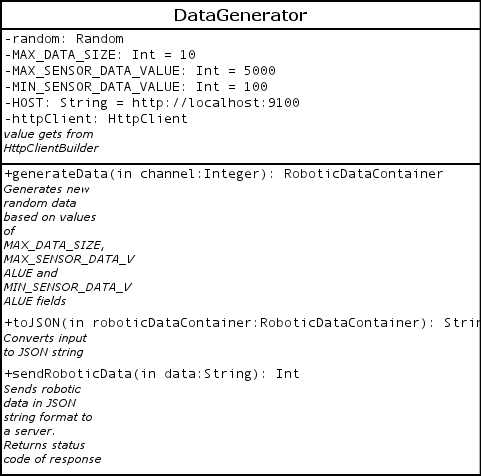

# Data Generator

Data generator generates robotic data container for test purposes.

## How to use
1. Call generateData method for generating
1. Call toJSON method with generated data as input.
1. Call sendData method with result of previous step as an argument
