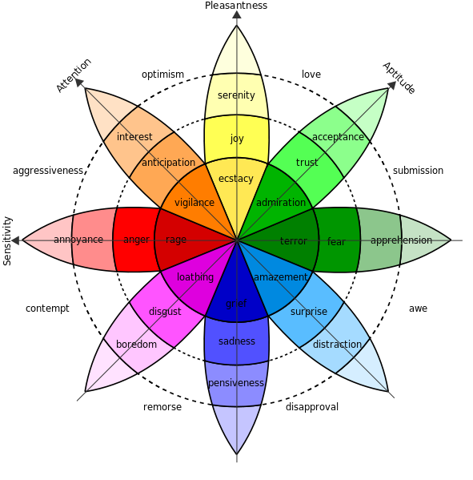

# Emotional behavior

According to [Sentic computing: 3.2.2 The Hourglass of Emotions](http://sentic.net/senticcomputing.pdf) Plutchik´s wheel of emotions could be represented in 4 sentic axis:

 1. Sensitivity
 1. Attention
 1. Pleasantness
 1. Aptitude

On each axis lies 2 emotions with 3 sentic levels, see diagram above.

According to [Sentic computing: 3.2.2 The Hourglass of Emotions](http://sentic.net/senticcomputing.pdf) there are 6 emotional states on each axis:

 1. Sensitivity: rage, anger, annoyance, apprehension, fear, terror.
 1. Attention: vigilance, anticipation, interest, distraction, surprise, amazement.
 1. Pleasantness: ecstasy, joy, serenity, pensiveness, sadness, grief.
 1. Aptitude: admiration, trust, acceptance, boredom, disgust, loathing.

Emotions on one axis has same nature that determines the way they affect the system.
According ot the way emotions affect the system behaviour sentic axises are grouped in a following way:

 1. Resource distribution is affected by:
   2. Sensitivity
   2. Attention
 1. Emotional highlight is affected by:
  2. Pleasantness
  2. Aptitude

## Resource distribution

Resource distribution is influenced in 2 dimensions: Sensitivity manages speed of processes and Attention manges number of resources, for example thinking threads.
 * Sensitivity:Rage makes system act as quick as possible taking in account as less variants as possible.
 * Sensitivity:Terror makes system struck almost stopping all current computations.
 * Attention:Vigilance makes system concentrate all computational resources on current task. All available threads should be distributed to current process.
 * Attention:Amazement releases as much computational resources as possible leaving current process with minimum threads.

##Emotional highlight

Emotional highlight is two dimensional: Pleasantness to Aptitude.
Each training act, such as: domain concept explanation, feedback and so on is highlighted in two dimensions according to current positive impression (pleasantness) and future benefit expectations(aptitude).

