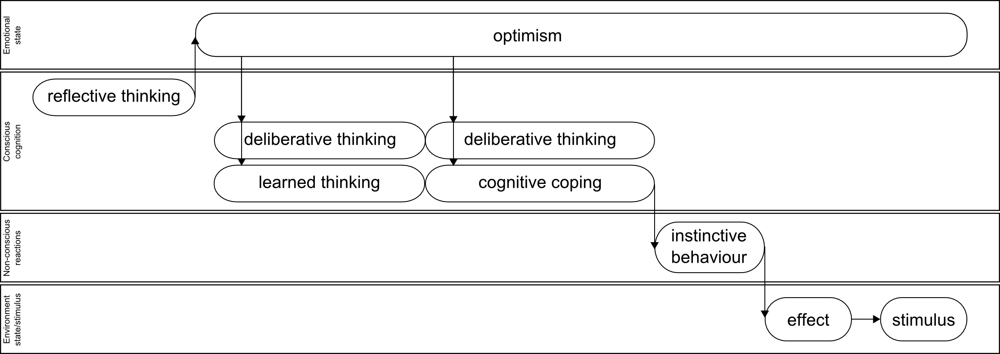

#Appraisal, coping and high level emotions aspects of emotional thinking.

##Introduction 

There are three bases of computational emotions thinking theory presented in our previous[computational_emotional_thinking] and current article: neuroscience: [emotionsbraintorobot, parsingreward, neuromodulatory, cubeofemotions, natureofemotions], to computer science: [emotionandsociable, senticcomputing, hourglass, affectivemodelofinterplay, affectivecomputing, computationalmodelsemotion, computationalmodelsemotionscognition, evaluatingcomutationalmodel, threelevel] and evolutional psychology: [natureofemotions, primer_affect_psychology, tomkins1, tomkins2, tomkins3, tomkins4].

Overall emotional process was described exhaustively in our previous article [computational_emotional_thinking] and looks like following:

1. Inbound stimulus is appraised non-consciously (affective appraisal).
1. Neuromodulation is triggered, it actually switches the emotional state of the system. System feels emotion.
1. Conscious processes are triggered: stimulus cognition with stimulus deliberation, stimulus reflective thinking, stimulus cognition reflection, stimulus cognition self-reflection, stimulus cognition self-conscious reflection (cognitive appraisal).
1. Parallel to conscious processes the instinctive behaviour could be triggered, it influences the environment.
1. Conscious processes described above triggers conscious behaviour and its turn it influences the environment again.

Neuromodulators influence in emotional processes was described in Lovheim article [cubeofemotions]. We used Plutchik "wheel of emotions" as base psychological model of emotions [natureofemotions] and adopted his emotional feedback loops processes to fit cognitive architecture "model of six" of Marvin Minksy [emotionmachine]. We developed mapping of neuromodulators impact over computational processes:

 1. Generic:
   2. CPU power: noradrenaline
   2. Memory distribution (attention): noradrenaline
   2. Learning: serotonin, dopamine
   2. Storage: serotonin, dopamine
 1. Decision making/reward processing:
   2. Confidence: serotonin
   2. Satisfaction: serotonin
   2. Motivation, wanting: dopamine
   2. Risky choices inclination: noradrenaline
   2. Number of options to process: noradrenaline

Thus we identified psychological phenomena of emotions influence on computational processes. This could be used as base for further computational emotional thinking framework. We defined overall architecture of emotional processes but we left several aspects not described for further research. Current article is dedicated to cover those blank spots: emotional appraisal (non-conscious and conscious), coping and influence of high level emotions on computational processes.

##Orchestra of emotions

Imagine the number of emotions we experience every day, every minute, starting from wake up in the morning till the late evening. Every action or significant change in environment is followed by emotional response. When we were kids and we could not control emotions expressions even wake up and teeth wash was emotional scene. From psychology and neuroscience perspective [emotionsbraintorobot, neuromodulatory, natureofemotions, primer_affect_psychology] we could identify two types of emotional reactions: low level - non-conscious (affective appraisal) and high level conscious reactions (cognitive appraisal, cognitive reappraisal, reflective thinking, etc).

Each time any stimulus comes in view of the system it is appraised firstly non-consciously (affective appraisal). Affective appraisal triggers neuromodulation, that actually switches emotional state of the system and influences all the further processes. Stimulus is appraised second time consciously (cognitive appraisal). Later the result of cognitive appraisal could trigger coping strategy that in its turn influences environment or emotional state of the system.

First stimulus triggers affective appraisal which in its turn switches the emotional state of the system from neutral to fear and initiates cognitive appraisal and reflective thinking. Second stimulus triggers second affective appraisal again and switches emotional state of the system from fear to terror and initiates second cognitive appraisal and instinctive coping behavior. Then first cognitive appraisal switches emotional state from terror to fear (system understood that stimulus is not so horrible as it seemed firstly) and initiates conscious coping behavior and cognitive reappraisal. Then reflective thinking terminates cognitive reappraisal and conscious coping and switches emotional state no neutral. Meanwhile instinctive coping acts over environment (for example system could run away from second stimulus that triggered terror) and effect of the action(system is in safe place) is interpreted as third stimulus that triggers affective appraisal again.

This is picture of the constant collaboration of thinking processes [emotionmachine], involved in emotional appraisal, coping and reflective thinking. We mapped appraisal processes described in [putting_appraisal_in_context, appraisal_determinants_of_emotions, appraisal_considered_as_a_process] over thinking model of six of Marvin Minksy [emotionmachine]. Orchestra of emotions is concept that emphasises constant collaboration of low level (instinctive processes) with high level: learned reactions, deliberative thinking, reflective thinking processes via switching emotional states and initiating/terminating thinking processes. We used orchestra analogy to identify always changing and intermittent nature of thinking processes and their  collaboration that eventually combines in emotional personality, like parties of musical instruments combines in overall sound of orchestra.

##Appraisal aspect

First aspect that is not described in previous article [computational_emotional_thinking]: how inbound stimulus is appraised to trigger proper emotion? There are several appraisal theories that we used to find proper answer to this question. We explored Scherer, Smith and Kirby, Roseman and Tomkins  approaches of synthesise appraisal framework.
Overall appraisal process could be depicted like presented below

Firstly stimulus is appraised non-consciously via affective appraisal it could be interpreted like signal processing in spinal cord, hypothalamus and amygdala, secondly stimulus is processed via cognitive appraisal that takes place in frontal cortex and cingulate cortex. We correspond affective appraisal with instinctive layer of Minsky's thinking model (model of six) [emotionmachine]. This non-conscious appraisal triggers neuromodulation [cubeofemotions] and then cognitive appraisal which in its turn corresponds to: learned reactions, deliberative, reflective thinking, self-reflective thinking, self-conscious reflections layers of Minsky's model of six. Cognitive appraisal usually is associated with much longer process than instinctive affective appraisals that could influence non-conscious processes(behavior) and emotional state. After this cognitive reappraisal could change the emotional state taking in account some deliberative thinking of the stimulus and the personality relation with it.

###Non-conscious appraisal

Lovheim uses Tomkins theory of affects that refer to innate emotional reactions we uses it as appraisal base for non-conscious emotional reactions. Tomkins theory [tomkins1, tomkins2, tomkins3, tomkins4] includes following affects:

1. Enjoyment/Joy
1. Interest/Excitement
1. Surprise
1. Anger/Rage
1. Disgust
1. Distress/Anguish
1. Fear/Terror
1. Shame/Humiliation

We use affective appraisal described in ["A primer of affect psychology"][primer_affect_psychology]. The main factor that influences affective appraisal is CNS activity that has three main behaviour trends: increase, decrease or stay stable.

According to ["A primer of affect psychology"][primer_affect_psychology]: quickest increase of brain activity triggers **surprise**, a bit slower increase - **fear/terror**, and most moderate - **interest/excitement**.

Moderate steady CNS activity triggers **distress/anguish**, while high steady activity triggers **anger/rage**, both of them negative.
It worth to note that the higher distress CNS activity the easier is switch to anger. We could interpret this like: the longer person is in distress state the easier he/she could be switched to anger state.

Decrease of CNS activity is interpreted as relief and triggers **enjoyment/joy**.

"**Disgust** NEGATIVE affect is inherently punishing and provides us some protection against eating poisonous or rotten food." We consider this affect as unconditional rejection of inbound stimulus as something directly damaging the system. This could be understood as low level hard-coded predicate to protect system.

**Shame humiliation** "affect is neither inherently punishing nor rewarding. It is like a computer’s reset button that rapidly clears the system and prepares us for whatever comes next... Without the innate affect shame-humiliation, we would not be motivated to take action when we are deprived of interesting and enjoyable things." This complex affect that appeared to be latest in evolutional process of humans is triggered when system was prevented to get new interesting information.

###Conscious appraisal

We use Tomkins theory that is based on innate affects which we correspond with Plutchik [basic emotions][natureofemotions]. Our main assumption is: conscious and non-conscious appraisal could have different nature because one is based on innate evolved system of emotions(affects) the later is based on nurture and education of human and is learned during childhood. Innate and quick affective appraisal is processed in automatic way mostly insensibly for human, it does not include long term deliberations, learned reactions or reflection thinking. In contrast to affective appraisal, conscious cognitive appraisal includes learned reactions, deliberations and reflective thinking. It could take some significant time that could exceed affective appraisal a few tens of times. This factors, especially involvement of learned reactions mechanisms defines nature of conscious appraisal. We suppose that main mechanism defining the conscious appraisal is nurture/education of personality to react in some specific way on some specific stimulus. We use Scherer's approach described in ["Appraisal considered as process of multilevel sequential checking"][appraisal_as_sequential_checking]. We use Plutchik [natureofemotions] as model for conscious emotions. This model consists of 8 basic emotions grouped in pairs.

1. Joy - sorrow
1. Anger - fear
1. Surprise - expectancy
1. Acceptance - disgust

Scherer uses 16 stimulus evaluation checks(SEC), they are organized in 4 groups: relevance detection, implication assessment, coping potential and normative significance.
Comprehensive SECs structure below: 

1. Relevance detection
  2. Novelty check.
    3. Suddenness.
    3. Familiarity.
    3. Predictability.
  2. Intrinsic pleasantness check.
  2. Goal relevance.
1. Implication assessment
  2. Causal Attribution check: intentional(int)/other/natural(nat)/negligence(neg)/chance(ch).
  2. Outcome probability check.
  2. Discrepancy from expectation check: consonant/dissonant.
  2. Goal/need conduciveness check: high/obstruct.
  2. Urgency check.
1. Coping potential determination
  2. Control check.
  2. Power check.
  2. Adjustment check.
1. Normative significance evaluation
  2. Internal standards check. 
  2. External standards check.

Each of stimulus evaluation checks has following set of possible values:

1. very low (vl)
1. low (l)
1. medium (m)
1. high (h)
1. very high (vh)
1. open (o), check does not influences this specific emotion.

Except for causal attribution check that has following possible values: intentional(int)/other/natural(nat)/negligence(neg)/chance(ch),  discrepancy from expectation check: consonant/dissonant values and goal/need conduciveness check: high/obstruct.

Scherer uses 14 words to describe emotions in his analysis:

1. Enjoyment/happiness
1. Elation/joy
1. Displeasure/disgust
1. Contempt/scorn
1. Sadness/dejection
1. Dispair
1. Anxiety/worry
1. Fear
1. Irritation/cold anger
1. Rage/hot anger
1. Boredom/indiferance
1. Shame
1. Guilt
1. Pride

Scherer discovered 224 appraisal patterns that we used as the base for our appraisal predicates. 14 emotions described in Scherer's article do not mach 8 Plutchik basic emotions, there no: surprise, anticipation and trust. We used linear interpolation following Plutchik's idea to use color theory for representation of emotions to calculate values of SECs for these three basic emotions. Comprehensive list of conscious appraisal patterns/predicates is placed in appendix. Predicates should be considered probabilistic, each level: very low, low, medium, high, very high should be considered as range of the probabilities. Each time stimulus triggers matching procedure, described in conscious appraisal algorithm section, the most close pattern triggers proper emotion.

###Conscious appraisal algorithm

Scherer identifies [appraisal_as_sequential_checking] sequence of appraisal objectives as following:

1. Relevance check including: novelty check, intrinsic pleasantness check, goal relevance check.
1. Implication check including: causal attribution check, outcome probability check, discrepancy from expectation check, goal/need conduciveness check, urgency check.
1. Coping potential including: control check, power check, adjustment check.
1. Normative significance including: internal standards check, external standards check.

All included checks are done in parallel during appraisal objectives checks, but objectives checks are done in sequental manner.
Result values of checks are stored in so called registers that are updated each time new stimulus appraised.

##Coping

Second aspect that is not described in previous article: what is done as response to emotional arousal(switch of emotional state), or how humans cope with emotions?
Marsella and Gratch in their article [dont_worry_be_happy] identified 2 types of coping (emotion-focused coping and problem-focused coping) as main response on emotional arousal and appraisal and mentioned that coping plays central role in causal interpretation and emotional thinking life cycle.

###Emotion-focused coping

Emotion-focused coping is identified as: "Emotion-focused coping works altering one’s interpretation of circumstances, for example, discounting a potential threat or abandoning a cherished goal." As the result of an emotion-focused coping system should change emotional state without any or with minimal impact over environment.

Emotion coping strategies described in [dont_worry_be_happy]:

1. Positive reinterpretation: look for silver lining;
1. Acceptance: accept stressor as real. Live with it.
1. Seeking  social  support  for  emotional  reasons: getting moral support, sympathy.
1. Denial: denying the reality of event.
1. Behavioral disengagement: Admit cannot deal.
1. Mental  disengagement:  Use  other  activities  to take mind off problem: daydreaming, sleeping

Stimulus triggers affective appraisal then affective appraisal switches emotional state of the system from neutral to fear, initiates cognitive appraisal and instinctive behaviour. Cognitive appraisal initiates emotion-focused coping, that in its turn switches fear state to neutral (evaluating current situation as not so frightening via positive reinterpretation). Meanwhile instinctive behaviour influences environment and effect of this influence is apprised as stimulus with second affective appraisal.

###Problem-focused coping

Problem-focused coping is defined in contrast to emotion-focused coping as "... acting on the environment". Problem-focused coping includes: planning and suppression of competing activities.

Inbound stimulus triggers affective appraisal and it switches emotional state of the system from neutral to fear, then affective appraisal initiates cognitive appraisal. This appraisal usually includes several processes on learned, deliberative, reflective thinking and possibly self-reflective thinking levels. Result of cognitive appraisal and supplemental thinking processes could be problem-focused coping. It worth to note that decision to use specific coping strategy could be gender dependant [sex_differencies]. Later, during problem-focused coping some strategy is selected (for example planning) and used. Actions of the strategy changes environment and system now faces effect as new stimulus to be appraised. Second affective appraisal switches system emotional state to neutral as the result of effect evaluation.

In this chapter we come close to questions of gender influence on decision making and coping strategy selection [sex_differencies]. One more aspect that was not explicitly described here but still has significant influence on appraisal and coping is temperament that could significantly influence selection of coping strategy and cognitive appraisal.

##High level emotion influence over affects and neuromediators

Plutchik identifies high level emotions [natureofemotions] as mixture of 2 or more basic emotions(affects). For examle:

1. Optimism =	Anticipation + Joy
1. Love =	Joy + Trust
1. Submission = Trust + Fear
1. Awe = Fear + Surprise
1. Disapproval = Surprise + Sadness
1. Remorse = Sadness + Disgust
1. Contempt = Disgust + Anger
1. Aggressiveness =	Anger + Anticipation

Plutchik uses color theory as main approach to combine basic emotions in to high level. Basic emotions of Plutchik theory are close to Tomkins affects that are innate emotional reactions. Lovheim recently presented neuromediators based approach called "Cube of emotions"[cubeofemotions]. Lovheim demonstrates relations of neuromodulators levels and emotional/affective states. High level emotions could be interpreted as intermediate levels of neuromodulators in "Cube of emotions"[cubeofemotions].

Reflective thinking switches emotional state to optimism. Emotional state of optimism influences: deliberative thinking and learned thinking, second deliberative thinking and cognitive coping. Learned thinking under influence of optimism initiates "optimistic" cognitive coping and later "optimistic" instinctive behaviour is triggered.

High level thinking processes including cognitive appraisal always are influenced by affects via neuromodulation and in their turn influence low level (and other) thinking processes via cognitive emotion-focused coping and neuromodulation according to matrix below.

We suppose that Gaussian function regulates influence of subjective human perception of inbound stimulus over objective brain response. Semir Zeki [neuralcorrelatesofhate] describes emotion (hate) correlation to neural activities as Gaussian. Taking in account Gaussian nature of influence of subjective emotional state over objective brain response, *high level emotions to neuromodulators mapping* could be represented as following:

1. **G(Optimism Intensity)** = 1.0 serotonin  + 1.0 dopamine + 0.5 noradrenaline;
1. **G(Love Intensity)** = 0.75 serotonin + 1.0 dopamine + 0.0 noradrenaline;
1. **G(Submission Intensity)** = 0.25 serotonin + 1.0 dopamine + 0.0 noradrenaline;
1. **G(Awe Intensity)** = 0.5 serotonin + 0.5 dopamine + 0.5 noradrenaline;
1. **G(Disapproval Intensity)** = 0.5 serotonin + 0.0 dopamine + 1.0 noradrenaline;
1. **G(Remorse Intensity)** = 0.0 serotonin + 0.0 dopamine + 0.0 noradrenaline;
1. **G(Contempt Intensity)** = 0.5 serotonin + 0.5 dopamine + 0.5 noradrenaline;
1. **G(Aggressiveness Intensity)** =	0.5 serotonin + 1.0 dopamine + 1.0 noradrenaline;

This high level emotions over neuromodulators levels mapping closes emotion - neuromodulation mutual influences. Shortly: the affective appraisal switches emotional state via neuromodulation and switching emotional state via high level processes(reflective thinking, self-reflective thinking, self-conscious reflections) triggers neuromodulation and thus influences all other thinking processes.

High level emotions also triggers neuromodulation with neurotransmitters levels described above thus influence all thinking processes of the system.

##Conclusion

1. Gender
1. Temper

In previous article [computational_emotional_thinking] we described overall emotional process in Marvin Minsky [emotinmacine] cognitive architecture. We used three following bases:

1. Evolutionary psychology: Plutchik wheel of emotions[natureofemotions].
1. Neuro-science: Lovheim cube of emotions [cubeofemotions].
1. Artificial intelligence: cognitive architecture: Minsky "The Emotion Machine" [emotionmachine].

This article covers three aspects that was not covered in previous paper [computational_emotional_thinking]: appraisal, coping and influence of high-level emotions on computational system.
Emotional appraisal process, is based  and Scherer approach [appraisal_as_sequential_checking]. We identified two types of appraisal: non-conscious affective appraisal and conscious cognitive appraisal. First is based on on affect theory of Tomkins [primer_affect_psychology] and takes in account only innate emotional reactions. Main parameter of non-conscious appraisal is CNS activity that influences appraisal as following:

* Quickest increase of brain activity triggers **surprise**, a bit slower increase - **fear/terror**, and most moderate - **interest/excitement**.
* Moderate steady CNS activity triggers **distress/anguish**, while high steady activity triggers **anger/rage**, both of them negative.
* Decrease of CNS activity is interpreted as relief and triggers **enjoyment/joy**.
* Disgust - could be understood as low level hard-coded predicate to protect system.
* Shame humiliation this complex affect that appeared to be latest in evolutional process of humans is triggered when system is prevented from getting new interesting information.

Conscious appraisal is more complex and includes learned rules. It is based no Scherer sequential appraisal approach [appraisal_as_sequential_checking]. We adopted Scherer's processes to Plutchik "Wheel of emotion" [natureofemotions] model. Complete set of conscious appraisal predicates are listed in appendix. Conscious appraisal algorithm contains 4 steps:

1. Relevance check including: novelty check.intrinsic pleasantness check, goal relevance included.
1. Implication including: causal Attribution check, outcome probability check, discrepancy from expectation check, goal/need conduciveness check, urgency check
1. Coping potential including: control check, power check. adjustment check.
1. Normative significance including: internal standards check, external standards check.

All the sub-steps are processed in parallel.

Coping is based on [dont_worry_be_happy] and includes two main groups: problem-focused and emotion-focused coping strategies. Coping is main emotional mechanism to process emotional state that was triggered during appraisal. Should be mentioned that decision to select specific coping strategy is considered to be done under influence of gender and temperament. Those are still open questions in our work.

High-level emotions were described by Plutchik [natureofemotions] as mixture of 2 or more basic emotions(affects):

1. Optimism =	Anticipation + Joy
1. Love =	Joy + Trust
1. Submission = Trust + Fear
1. Awe = Fear + Surprise
1. Disapproval = Surprise + Sadness
1. Remorse = Sadness + Disgust
1. Contempt = Disgust + Anger
1. Aggressiveness =	Anger + Anticipation

We suppose that high-level emotions influence neuromodulation via following matrix:

1. **G(Optimism Intensity)** = 1.0 serotonin  + 1.0 dopamine + 0.5 noradrenaline;
1. **G(Love Intensity)** = 0.75 serotonin + 1.0 dopamine + 0.0 noradrenaline;
1. **G(Submission Intensity)** = 0.25 serotonin + 1.0 dopamine + 0.0 noradrenaline;
1. **G(Awe Intensity)** = 0.5 serotonin + 0.5 dopamine + 0.5 noradrenaline;
1. **G(Disapproval Intensity)** = 0.5 serotonin + 0.0 dopamine + 1.0 noradrenaline;
1. **G(Remorse Intensity)** = 0.0 serotonin + 0.0 dopamine + 0.0 noradrenaline;
1. **G(Contempt Intensity)** = 0.5 serotonin + 0.5 dopamine + 0.5 noradrenaline;
1. **G(Aggressiveness Intensity)** =	0.5 serotonin + 1.0 dopamine + 1.0 noradrenaline;

We suppose that this work could be used as base of emotional cognitive architecture and could have practical use especially taking in account artificial emotional profiles that could be used in several domains:

1. Advertisement
1. Emotional behavior simulations
1. Robotics
1. Intellectual assistants
1. Estimating human behaviour
1. Caring for humans software and robotics

##Appendix

###Conscious appraisal predicates

####Joy

1. Relevance detection:
  2. Novelty check:
    3. Suddenness. = m-h
    3. Familiarity. = o
    3. Predictability. = l
  2. Intrinsic pleasantness check. = o
  2. Goal relevance. = h
1. Implication assessment:
  2. Causal Attribution check.
    3. Cause: agent. = o
    3. Cause: motive. = ch
  2. Outcome probability check. = vh
  2. Discrepancy from expectation check. = o
  2. Goal/need conduciveness check. = vh
  2. Urgency check. = l
1. Coping potential:
  2. Control check. = o
  2. Power check. = o
  2. Adjustment check. = m
1. Normative significance evaluation:
  2. Internal standards check. = o
  2. External standards check. = o

####Anticipation

1. Relevance detection:
  2. Novelty check:
    3. Suddenness. = m
    3. Familiarity. = o
    3. Predictability. = l
  2. Intrinsic pleasantness check. = o
  2. Goal relevance. = h
1. Implication assessment:
  2. Causal Attribution check.
    3. Cause: agent. = o
    3. Cause: motive. = int
  2. Outcome probability check. = vh
  2. Discrepancy from expectation check. = d
  2. Goal/need conduciveness check. = h
  2. Urgency check. = m
1. Coping potential:
  2. Control check. = o
  2. Power check. = o
  2. Adjustment check. = o
1. Normative significance evaluation:
  2. Internal standards check. = o
  2. External standards check. = l

####Anger

1. Relevance detection:
  2. Novelty check:
    3. Suddenness. = l,h
    3. Familiarity. = o,l
    3. Predictability. = m,l
  2. Intrinsic pleasantness check. = o
  2. Goal relevance. = m,h
1. Implication assessment:
  2. Causal Attribution check.
    3. Cause: agent. = o, other
    3. Cause: motive. = int/neg
  2. Outcome probability check. = vh
  2. Discrepancy from expectation check. = o, d
  2. Goal/need conduciveness check. = ob
  2. Urgency check. = m,h
1. Coping potential:
  2. Control check. = h
  2. Power check. = m,h
  2. Adjustment check. = h
1. Normative significance evaluation:
  2. Internal standards check. = o
  2. External standards check. = l

####Disgust

1. Relevance detection:
  2. Novelty check:
    3. Suddenness. = o
    3. Familiarity. = l
    3. Predictability. = l
  2. Intrinsic pleasantness check. = vl
  2. Goal relevance. = l
1. Implication assessment:
  2. Causal Attribution check.
    3. Cause: agent. = o
    3. Cause: motive. = o
  2. Outcome probability check. = vh
  2. Discrepancy from expectation check. = o
  2. Goal/need conduciveness check. = o
  2. Urgency check. = m
1. Coping potential:
  2. Control check. = o
  2. Power check. = o
  2. Adjustment check. = o
1. Normative significance evaluation:
  2. Internal standards check. = o
  2. External standards check. = o

####Sadness

1. Relevance detection:
  2. Novelty check:
    3. Suddenness. = l
    3. Familiarity. = l
    3. Predictability. = o
  2. Intrinsic pleasantness check. = o
  2. Goal relevance. = h
1. Implication assessment:
  2. Causal Attribution check.
    3. Cause: agent. = o
    3. Cause: motive. = cha/neg
  2. Outcome probability check. = vh
  2. Discrepancy from expectation check. = o
  2. Goal/need conduciveness check. = ob
  2. Urgency check. = l
1. Coping potential:
  2. Control check. = vl
  2. Power check. = vl
  2. Adjustment check. = m
1. Normative significance evaluation:
  2. Internal standards check. = o
  2. External standards check. = o

####Surprise

1. Relevance detection:
  2. Novelty check:
    3. Suddenness. = m
    3. Familiarity. = l
    3. Predictability. = vl
  2. Intrinsic pleasantness check. = vl
  2. Goal relevance. = h
1. Implication assessment:
  2. Causal Attribution check.
    3. Cause: agent. = oth/nat
    3. Cause: motive. = cha/neg
  2. Outcome probability check. = vh
  2. Discrepancy from expectation check. = d
  2. Goal/need conduciveness check. = ob
  2. Urgency check. = m
1. Coping potential:
  2. Control check. = vl
  2. Power check. = vl
  2. Adjustment check. = m
1. Normative significance evaluation:
  2. Internal standards check. = o
  2. External standards check. = o

####Fear

1. Relevance detection:
  2. Novelty check:
    3. Suddenness. = h
    3. Familiarity. = l
    3. Predictability. = l
  2. Intrinsic pleasantness check. = l
  2. Goal relevance. = h
1. Implication assessment:
  2. Causal Attribution check.
    3. Cause: agent. = oth/nat
    3. Cause: motive. = o
  2. Outcome probability check. = h
  2. Discrepancy from expectation check. = d
  2. Goal/need conduciveness check. = ob
  2. Urgency check. = vh
1. Coping potential:
  2. Control check. = o
  2. Power check. = vl
  2. Adjustment check. = l
1. Normative significance evaluation:
  2. Internal standards check. = o
  2. External standards check. = o

####Trust

1. Relevance detection:
  2. Novelty check:
    3. Suddenness. = h
    3. Familiarity. = vl
    3. Predictability. = l
  2. Intrinsic pleasantness check. = vl
  2. Goal relevance. = h
1. Implication assessment:
  2. Causal Attribution check.
    3. Cause: agent. = oth/nat
    3. Cause: motive. = ch
  2. Outcome probability check. = vh
  2. Discrepancy from expectation check. = c
  2. Goal/need conduciveness check. = vh
  2. Urgency check. = m
1. Coping potential:
  2. Control check. = o
  2. Power check. = vl
  2. Adjustment check. = m
1. Normative significance evaluation:
  2. Internal standards check. = o
  2. External standards check. = o

[primer_affect_psychology]: http://www.tomkins.org/uploads/Primer_of_Affect_Psychology.pdf "Primer Affect Psychology"
[natureofemotions]: http://google.com "Nature of emotions"
[appraisal_as_sequential_checking]: http://google.com "Appraisal considered as process of multilevel sequential checking"
