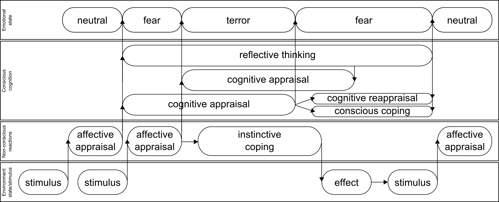
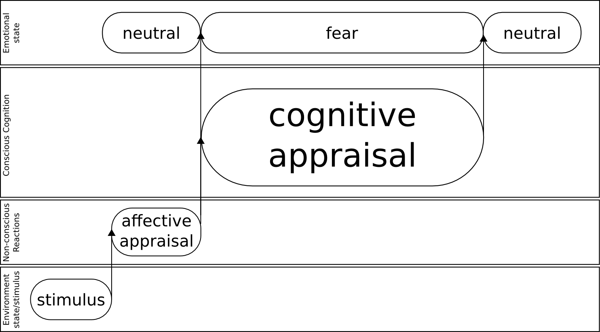
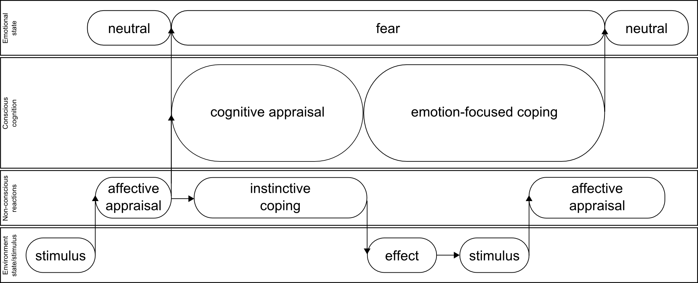
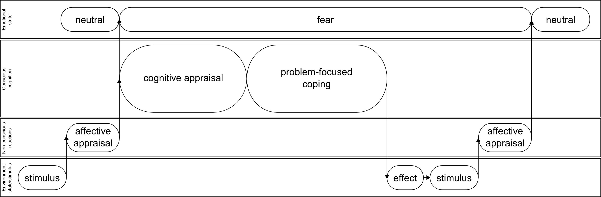

# Appraisal and coping aspects of emotional thinking.

## Introduction 

1. Reference to previous article
1. AI background (system)

## Orchestra of emotions

Imagine the number of emotions we experience every day, starting from wake up in the morning till the late evening. Every action or significant change in environment is followed by emotional response. When we were kids and we could not control emotions expressions even wake up and teeth wash was emotional scene. From neuroscience perspective [...] we could identify two types of emotional reactions: low level - non-conscious and high level conscious reactions.

Each time any stimulus comes in view of the system it is been appraised first non-consciously then consciously and then initiates high level reflective thinking. First stimulus triggers affective appraisal which in its turn switches emotional state from neutral to fear and initiates cognitive appraisal and reflective thinking. Second stimulus triggers second affective appraisal again and switches emotional state of the system from fear to terror and initiates second cognitive appraisal and instinctive coping behaviour. Then first cognitive appraisal switches emotional state from terror to fear (system understood that stimulus is not so horrible as it seemed firstly) and initiates conscious coping behaviour and cognitive reappraisal. Reflective thinking terminates cognitive reappraisal and conscious coping and switches emotional state no neutral. Meanwhile instinctive coping acts over environment (for example system could run away from second stimulus that triggered terror) and effect of the action(system is in safe place) is interpreted as third stimulus that triggers affective appraisal again.

This is picture of the constant collaboration of thinking processes, see [emotionmachine] involved in emotional appraisal, coping and reflective thinking. We have tried to map appraisal processes described in [putting_appraisal_in_context, appraisal_determinants_of_emotions, appraisal_considered_as_a_process] over thinking model of six of Marvin Minksy. Orchestra of emotions is concept that emphasises constant collaboration of low level (instinctive processes) with high level: learned reactions, deliberative thinking, reflective thinking etc. processes via switching emotional states and initiating/terminating thinking processes. We used orchestra analogy to identify all the time changing and intermittent nature of thinking processes and their  collaboration that eventually combines in emotional personality, like parties of musical instruments combines in overall sound of orchestra.  

##Appraisal aspect

First aspect that is not described in previous article: how inbound stimulus is appraised to trigger proper emotion? There are several appraisal theories that we used to find proper answer to this question. We explored Scherer, Smith and Kirby, Roseman and Tomkins  approaches of synthesise appraisal framework.
Overall appraisal process could be depicted like presented below

Firstly stimulus is appraised non-consciously via affective appraisal it could be interpreted like signal processing in spinal cord, hypothalamus and amygdala secondly stimulus is processed via cognitive appraisal that takes place in frontal cortex and cingulate cortex. We correspond affective appraisal  with instinctive layer of Minsky's thinking model (model of six) [emotionmachine]. This non-conscious appraisal triggers neuromodulation [cubeofemotions] and then cognitive appraisal which in its turn corresponds to: learned reactions, deliberative, reflective thinking, self-reflective thinking, self-conscious reflections layers of Minsky's model of six. Cognitive appraisal usually is associated with much longer process than instinctive affective appraisals that could influence non-conscious processes(behaviour) and emotional state. After this cognitive reappraisal could change the emotional state taking in account some deliberative thinking of the stimulus and the personality relation with it.

### Non-conscious appraisal

We use Tomkins theory of affects that refer to innate emotional reactions as appraisal base for non-conscious emotional reactions. Tomkins theory [tomkins1, tomkins2, tomkins3, tomkins4] includes following affects:

Tomkins affects:

1. Enjoyment/Joy
1. Interest/Excitement
1. Surprise
1. Anger/Rage
1. Disgust
1. Distress/Anguish
1. Fear/Terror
1. Shame/Humiliation

We use Tomkins affective appraisal described in "A primer of affect psychology" [primer_affect_psychology]. The main factor that influences affective appraisal is brain activity that has three main behaviour trends: increase, decrease or stay stable.

According to Kelly: quickest increase of brain activity triggers **surprise**, a bit slower increase - **fear/terror**, and most moderate - **interest/excitement**.

Moderate steady CNS activity triggers **distress/anguish**, while high steady activity triggers **anger/rage**, both of them negative.
It worth to note that the higher distress CNS activity the easier is switch to anger. We could interpret this like: the longer person is in distress state the easier he/she could be switched to anger state.

Decrease of CNS activity is interpreted as relief and triggers **enjoyment/joy**.

"**Disgust** NEGATIVE affect is inherently punishing and provides us some protection against eating poisonous or rotten food." We consider this affect as indicator of unconditional rejection of inbound stimulus as something directly damaging the system. This could be understood as low level hard-coded predicate to protect system.

**Shame humiliation** "affect is neither inherently punishing nor rewarding. It is like a computer’s reset button that rapidly clears the system and prepares us for whatever comes next.

...

Without the innate affect shame-humiliation, we would not be motivated to take action when we are deprived of interesting and enjoyable things." This complex affect that appeared to be latest in evolutional process of humans is triggered when system was prevented to get new interesting information.

### Conscious appraisal

We use Tomkins theory that is based on innate affects which we roughly correspond with Plutchik basic emotions[natureofemotions]. Our main assumption is: conscious and non-conscious appraisal could have different nature as one is based on innate evolved system of emotions(affects) the later is based on nurture and education of human and is learned during childhood. Innate and quick affective appraisal is processed in automatic way mostly insensibly for human, it does not include long term deliberations, learned reactions or reflections. In contrast to affective appraisal, conscious cognitive appraisal done in frontal cortex and cingulate cortex and includes learned reactions, deliberations and reflective thinking. It could take some significant time that could exceed affective appraisal a few tens of times. This factors, especially involvement of learned reactions mechanisms defines nature of conscious appraisal. We suppose that main mechanism defining the conscious appraisal is education of personality to react in some specific way on some specific stimulus. We use Scherer's approach described in
"Appraisal considered as process of multilevel sequential checking"[appraisal_as_sequential_checking]. We use Plutchik [natureofemotion] as model for conscious emotions. This model consists of 8 basic emotions grouped in pairs.

1. Joy - sorrow
1. Anger - fear
1. Surprise - expectancy
1. Acceptance - disgust

Scherer uses 16 stimulus evaluation checks, they are organized in 4 groups: relevance detection, implication assessment, coping potential and normative significance.
See comprehensive SECs structure below: 

1. Relevance detection
  2. Novelty check.
    3. Suddenness.
    3. Familiarity.
    3. Predictability.
  2. Intrinsic pleasantness check.
  2. Goal relevance.
1. Implication assessment
  2. Causal Attribution check: intentional(int)/other/natural(nat)/negligence(neg)/chance(ch)
  2. Outcome probability check.
  2. Discrepancy from expectation check. = consonant/dissonant
  2. Goal/need conduciveness check. = high/obstruct
  2. Urgency check.
1. Coping potential determination
  2. Control check.
  2. Power check. (fight or flight).
  2. Adjustment check.
1. Normative significance evaluation
  2. Internal standards check. 
  2. External standards check.

Each of stimulus evaluation checks has following set of possible values:

1. very low (vl)
1. low (l)
1. medium (m)
1. high (h)
1. very high (vh)
1. open (o), check does not influences this specific emotion.

Except for causal attribution check that has following possible values: intentional(int)/other/natural(nat)/negligence(neg)/chance(ch),  discrepancy from expectation check: consonant/dissonant values and goal/need conduciveness check: high/obstruct.

Scherer uses 14 words to describe emotions in his analysis:

1. Enjoyment/happiness
1. Elation/joy
1. Displeasure/disgust
1. Contempt/scorn
1. Sadness/dejection
1. Dispair
1. Anxiety/worry
1. Fear
1. Irritation/cold anger
1. Rage/hot anger
1. Boredom/indiferance
1. Shame
1. Guilt
1. Pride

Scherer discovered 224 appraisal patterns that we used as the base for our appraisal predicates that you could find in appendix. 14 Scherer's emotions do not mach 8 Plutchik basic emotions. Model does not contain surprise, anticipation and trust. We used linear interpolation following Plutchik's idea to use color theory for representation of emotions to calculate values of SECs for those three emotions.

### Conscious appraisal algorithm

Scherer identifies [appraisal_as_sequential_checking] sequence of appraisal objectives as following:

1. Relevance check including: novelty check.intrinsic pleasantness check, goal relevance included.
1. Implication including: causal Attribution check, outcome probability check, discrepancy from expectation check, goal/need conduciveness check, urgency check
1. Coping potential including: control check, power check. adjustment check.
1. Normative significance including: internal standards check, external standards check.

All included checks are done in parallel during objectives checks, but objectives checks are done in sequental manner.
Result values of checks are stored is so called registers that are updated each time new stimulus appraised.

## Coping

Second aspect that is not described in previous article: what is done as response to emotional arousal(switch of emotional state), or how humans cope with emotions?
Marsella and Gratchi in their article [dont_worry_be_happy] identified 2 types of coping as main response on emotional arousal and appraisal. Coping plays central role in causal interpretation and emotional thinking life cycle.

### Emotion-focused coping

Emotion-focused coping is identified as: "Emotion-focused coping works altering one’s interpretation of circumstances, for example, discounting a potential threat or abandoning a cherished goal." As the result of an emotion-focused coping system should change emotional state without any or with minimal impact over environment.

Emotion coping strategies described in [dont_worry_be_happy]:

1. Positive reinterpretation: look for silver lining;
1. Acceptance: accept stressor as real. Live with it.
1. Seeking  social  support  for  emotional  reasons: getting moral support, sympathy.
1. Denial: denying the reality of event.
1. Behavioral disengagement: Admit cannot deal.
1. Mental  disengagement:  Use  other  activities  to take mind off problem: daydreaming, sleeping

Stimulus triggers affective appraisal then affective appraisal switches emotional state of the system from neutral to fear, initiates cognitive appraisal and instinctive behaviour. Cognitive appraisal initiates emotion-focused coping that in its turn switches fear state to neutral (evaluating current situation as not so frightening via positive reinterpretation). Meanwhile instinctive behaviour influences environment and effect of this influence is apprised as stimulus with second affective appraisal.

### Problem-focused coping

Problem-focused coping is defined in contrast to emotion-focused coping as "... acting on the environment". Problem-focused coping includes: planning and suppression of competing activities.

Inbound stimulus triggers affective appraisal and it switches emotional state of the system from neutral to fear, then appraisal initiates cognitive appraisal. This appraisal usually includes several processes on learned, deliberative, possibly reflective thinking  and self-reflective thinking levels. Result of cognitive appraisal and supplemental thinking processes could be problem-focused coping. It worth to note that decision to use emotion-focused or problem focused coping could be gender dependant [sex_differencies]. Then during problem-focused coping some strategy is selected (for example planning) and used. Actions of the strategy changes environment and system now faces effect as new stimulus to be appraised. Second affective appraisal switches system emotional state to neutral as the result of effect evaluation.

In this chapter we come close to questions of gender influence over decision making and coping strategy selection. One more aspect that was not explicitly described here but still has significant influence on appraisal and coping is temperament that could significantly influence selection of coping strategy and cognitive appraisal.

# High level emotion influence over affects and neuromediators

Plutchik "Wheel of emotions"[[wheel_of_emotions](https://en.wikipedia.org/wiki/Plutchik%27s_Wheel_of_Emotions#Plutchik.27s_wheel_of_emotions)][natureofemotions] high level emotions are produced as mixture of 2 or basic emotions(affects):

1. Optimism =	Anticipation + Joy
1. Love =	Joy + Trust
1. Submission = Trust + Fear
1. Awe = Fear + Surprise
1. Disapproval = Surprise + Sadness
1. Remorse = Sadness + Disgust
1. Contempt = Disgust + Anger
1. Aggressiveness =	Anger + Anticipation

[Tomkins](https://en.wikipedia.org/wiki/Silvan_Tomkins) used to address basic emotions as affects and Lovheim recently presented neuromediators based work called "Cube of emotions"[cubeofemotions]. Lovheim demonstrated relations of neuromediators levels and emotional/affective states.

... picture here

We interpret affects as instinctive reactions that stands close to objective brain response to any stimulus. High level emotions are mixtures of basic emotions/affects, they are interpreted as intermediate states in "Cube of emotions"[cubeofemotions].
   
## Stimulus affective appraisal

Firstly stimulus is appraised unconsciously and directly influences affective state and neuromediators levels, defined by Lovheim model[cubeofemotions]. Neuromodulation influences all conscious process including stimulus cognition. It could be imagined as affective interruptions and collaboration with whole picture of the cognition.

## Cognitive processes

Higher processes including stimulus cognition and cognitive appraisal all the time are influenced by affects via neuromodulation mechanisms.
And it their turn influence low level process via cognitive emotion-focused coping and neuromodulation according to matrix below.

We suppose that Gaussian function regulates influence of subjective human perception of inbound stimulus over objective brain response. Semir Zeki[neuralcorrelatesofhate] describes to emotion(hate) correlation to neural activities as Gaussian.
Taking in account Gaussian nature of influence of subjective emotional state over objective brain response, above matrix *High level emotions to neuromodulators mapping* should be represented as following:

1. **G(Optimism Intensity)** = 1.0 serotonin  + 1.0 dopamine + 0.5 noradrenaline;
1. **G(Love Intensity)** = 0.75 serotonin + 1.0 dopamine + 0.0 noradrenaline;
1. **G(Submission Intensity)** = 0.25 serotonin + 1.0 dopamine + 0.0 noradrenaline;
1. **G(Awe Intensity)** = 0.5 serotonin + 0.5 dopamine + 0.5 noradrenaline;
1. **G(Disapproval Intensity)** = 0.5 serotonin + 0.0 dopamine + 1.0 noradrenaline;
1. **G(Remorse Intensity)** = 0.0 serotonin + 0.0 dopamine + 0.0 noradrenaline;
1. **G(Contempt Intensity)** = 0.5 serotonin + 0.5 dopamine + 0.5 noradrenaline;
1. **G(Aggressiveness Intensity)** =	0.5 serotonin + 1.0 dopamine + 1.0 noradrenaline;

## Conclusion

1. Gender
1. Temper

## Appendix

### Conscious appraisal predicates

#### Joy

1. Relevance detection:
  2. Novelty check:
    3. Suddenness. = m-h
    3. Familiarity. = o
    3. Predictability. = l
  2. Intrinsic pleasantness check. = o
  2. Goal relevance. = h
1. Implication assessment:
  2. Causal Attribution check.
    3. Cause: agent. = o
    3. Cause: motive. = ch
  2. Outcome probability check. = vh
  2. Discrepancy from expectation check. = o
  2. Goal/need conduciveness check. = vh
  2. Urgency check. = l
1. Coping potential:
  2. Control check. = o
  2. Power check. = o
  2. Adjustment check. = m
1. Normative significance evaluation:
  2. Internal standards check. = o
  2. External standards check. = o

#### Anticipation

1. Relevance detection:
  2. Novelty check:
    3. Suddenness. = m
    3. Familiarity. = o
    3. Predictability. = l
  2. Intrinsic pleasantness check. = o
  2. Goal relevance. = h
1. Implication assessment:
  2. Causal Attribution check.
    3. Cause: agent. = o
    3. Cause: motive. = int
  2. Outcome probability check. = vh
  2. Discrepancy from expectation check. = d
  2. Goal/need conduciveness check. = h
  2. Urgency check. = m
1. Coping potential:
  2. Control check. = o
  2. Power check. = o
  2. Adjustment check. = o
1. Normative significance evaluation:
  2. Internal standards check. = o
  2. External standards check. = l

#### Anger

1. Relevance detection:
  2. Novelty check:
    3. Suddenness. = l,h
    3. Familiarity. = o,l
    3. Predictability. = m,l
  2. Intrinsic pleasantness check. = o
  2. Goal relevance. = m,h
1. Implication assessment:
  2. Causal Attribution check.
    3. Cause: agent. = o, other
    3. Cause: motive. = int/neg
  2. Outcome probability check. = vh
  2. Discrepancy from expectation check. = o, d
  2. Goal/need conduciveness check. = ob
  2. Urgency check. = m,h
1. Coping potential:
  2. Control check. = h
  2. Power check. = m,h
  2. Adjustment check. = h
1. Normative significance evaluation:
  2. Internal standards check. = o
  2. External standards check. = l

#### Disgust

1. Relevance detection:
  2. Novelty check:
    3. Suddenness. = o
    3. Familiarity. = l
    3. Predictability. = l
  2. Intrinsic pleasantness check. = vl
  2. Goal relevance. = l
1. Implication assessment:
  2. Causal Attribution check.
    3. Cause: agent. = o
    3. Cause: motive. = o
  2. Outcome probability check. = vh
  2. Discrepancy from expectation check. = o
  2. Goal/need conduciveness check. = o
  2. Urgency check. = m
1. Coping potential:
  2. Control check. = o
  2. Power check. = o
  2. Adjustment check. = o
1. Normative significance evaluation:
  2. Internal standards check. = o
  2. External standards check. = o

#### Sadness

1. Relevance detection:
  2. Novelty check:
    3. Suddenness. = l
    3. Familiarity. = l
    3. Predictability. = o
  2. Intrinsic pleasantness check. = o
  2. Goal relevance. = h
1. Implication assessment:
  2. Causal Attribution check.
    3. Cause: agent. = o
    3. Cause: motive. = cha/neg
  2. Outcome probability check. = vh
  2. Discrepancy from expectation check. = o
  2. Goal/need conduciveness check. = ob
  2. Urgency check. = l
1. Coping potential:
  2. Control check. = vl
  2. Power check. = vl
  2. Adjustment check. = m
1. Normative significance evaluation:
  2. Internal standards check. = o
  2. External standards check. = o

#### Surprise

1. Relevance detection:
  2. Novelty check:
    3. Suddenness. = m
    3. Familiarity. = l
    3. Predictability. = vl
  2. Intrinsic pleasantness check. = vl
  2. Goal relevance. = h
1. Implication assessment:
  2. Causal Attribution check.
    3. Cause: agent. = oth/nat
    3. Cause: motive. = cha/neg
  2. Outcome probability check. = vh
  2. Discrepancy from expectation check. = d
  2. Goal/need conduciveness check. = ob
  2. Urgency check. = m
1. Coping potential:
  2. Control check. = vl
  2. Power check. = vl
  2. Adjustment check. = m
1. Normative significance evaluation:
  2. Internal standards check. = o
  2. External standards check. = o

#### Fear

1. Relevance detection:
  2. Novelty check:
    3. Suddenness. = h
    3. Familiarity. = l
    3. Predictability. = l
  2. Intrinsic pleasantness check. = l
  2. Goal relevance. = h
1. Implication assessment:
  2. Causal Attribution check.
    3. Cause: agent. = oth/nat
    3. Cause: motive. = o
  2. Outcome probability check. = h
  2. Discrepancy from expectation check. = d
  2. Goal/need conduciveness check. = ob
  2. Urgency check. = vh
1. Coping potential:
  2. Control check. = o
  2. Power check. = vl
  2. Adjustment check. = l
1. Normative significance evaluation:
  2. Internal standards check. = o
  2. External standards check. = o

#### Trust

1. Relevance detection:
  2. Novelty check:
    3. Suddenness. = h
    3. Familiarity. = vl
    3. Predictability. = l
  2. Intrinsic pleasantness check. = vl
  2. Goal relevance. = h
1. Implication assessment:
  2. Causal Attribution check.
    3. Cause: agent. = oth/nat
    3. Cause: motive. = ch
  2. Outcome probability check. = vh
  2. Discrepancy from expectation check. = c
  2. Goal/need conduciveness check. = vh
  2. Urgency check. = m
1. Coping potential:
  2. Control check. = o
  2. Power check. = vl
  2. Adjustment check. = m
1. Normative significance evaluation:
  2. Internal standards check. = o
  2. External standards check. = o
