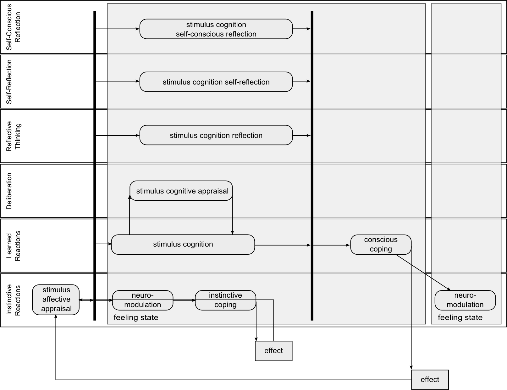

# High level emotion influence over affects and neuromediators

Plutchik "Wheel of emotions"[[wheel_of_emotions](https://en.wikipedia.org/wiki/Plutchik%27s_Wheel_of_Emotions#Plutchik.27s_wheel_of_emotions)] high level emotions are produced as mixture of 2 or basic emotions(affects):

1. Optimism =	Anticipation + Joy
1. Love =	Joy + Trust
1. Submission = Trust + Fear
1. Awe = Fear + Surprise
1. Disapproval = Surprise + Sadness
1. Remorse = Sadness + Disgust
1. Contempt = Disgust + Anger
1. Aggressiveness =	Anger + Anticipation

[Tomkins](https://en.wikipedia.org/wiki/Silvan_Tomkins) used to address basic emotions as affects and Lovheim recently presented neuromediators based work called "Cube of emotions". Lovheim demonstrated relations of neuromediators concentrations with emotional/affective states.

We interpret affects as instinctive reactions that stands close to objective brain response to any stimulus. High level emotions are mixtures of basic emotions/affects, they are interpreted as intermediate states in "Cube of emotions".

1. **Optimism** = 1.0 serotonin + 1.0 dopamine + 0.5 noradrenaline;
1. **Love** = 0.75 serotonin + 1.0 dopamine + 0.0 noradrenaline;
1. **Submission** = 0.25 serotonin + 1.0 dopamine + 0.0 noradrenaline;
1. **Awe** = 0.5 serotonin + 0.5 dopamine + 0.5 noradrenaline;
1. **Disapproval** = 0.5 serotonin + 0.0 dopamine + 1.0 noradrenaline;
1. **Remorse** = 0.0 serotonin + 0.0 dopamine + 0.0 noradrenaline;
1. **Contempt** = 0.5 serotonin + 0.5 dopamine + 0.5 noradrenaline;
1. **Aggressiveness** =	0.5 serotonin + 1.0 dopamine + 1.0 noradrenaline;
   
## Stimulus affective appraisal

Firstly stimulus is appraised unconsciously and directly influences affective state and neuromediators concentrations via Lovheim model. Neuromediation influences all conscious process including stimulus cognition. It could be imagined as affective orchestra plays, where each instrument is one affect that interfere and collaborate with whole picture of the cognition.

## Cognitive processes

Higher processes including stimulus cognition and cognitive appraisal all the time are influenced by affects via neuromodulation mechanisms.
And it their turn influence low level process via cognitive psychological coping and neuromodulation according to matrix above.
