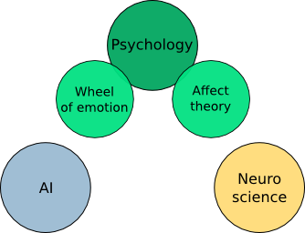
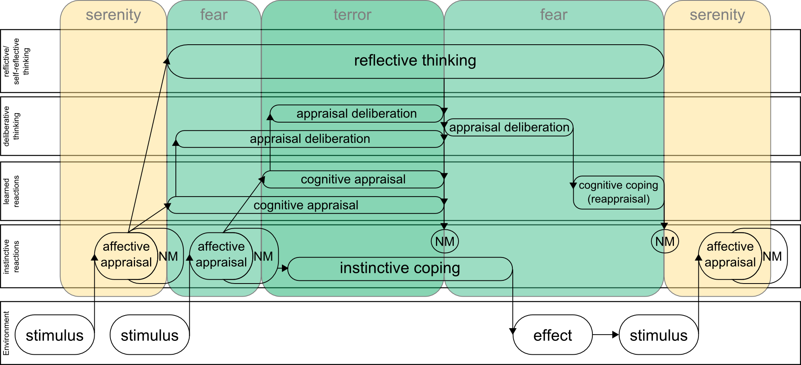
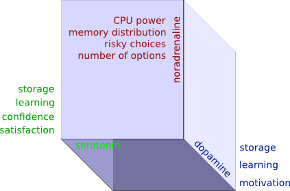
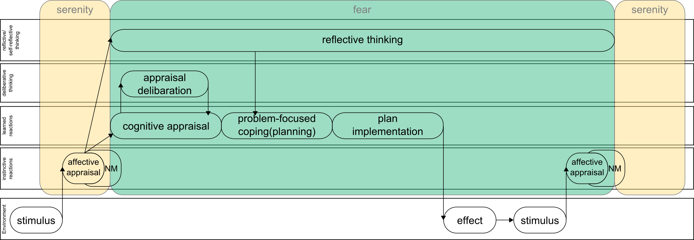

##Artificial emotions via virtual neuromodulators

## Introduction

Biggest problem of artificial intelligence is that we don't know what is natural intelligence. The only example of intelligence that we observe today is human intelligence. Unfortunately there are no aliens so far who would be able to demonstrate non-human intelligence, and examples on Earth lack certain substance. Rosalind Picard in her article indicated: "There may exist a kind of alien intelligent living system, something we’ve never encountered, which achieves its  intelligence without having anything like emotion. Although humans are the most marvellous example of intelligence we have, and we wish to build systems that are natural for humans to understand, these reasons for building human-like systems should not limit us to thinking only of human abilities." [affectivecomputingchallanges]

There are several domains that still remain unclear: creativity, intuition, insight and consciousness that prevents us from answering the question: "How David Lynch could create Mulholland Drive or Picasso could create Guernica?".
We have started from possibly the first intelligent method emerged during evolution and from the most primal component of intelligence: the emotions.

Turing stated in his [intelligent_machinery] that idea of intelligent machines "cannot be wholly ignored, because the idea of 'intelligence' is itself emotional rather than mathematical".
There is an interconnection between emotions and rational thought. Marvin Minsky in his book "The emotion machine" proposed that emotions are inseparable from thinking: "Emotional thinking: A flash of impatience or anger can cut through what seems like a hopelessly tangled knot. Each such ‘emotional way to think' is a different way to deal with things, and some can increase your persistence or courage, while others can help you simplify things. In any case, after each such change, you may still want to pursue some similar goals, but now you'll see them from new points of view — because each switch to a new Way to Think may initiate a large-scale cascade. Then, depending on how long those changes persist, you (or your friends) might recognize this as a change in your emotional state".

This article is dedicated to emotional aspects of human thinking and influence of emotions on computational processes in Marvin Minsky's cognitive architecture [emotionmachine]. It could be considered as base of computational emotional thinking framework and could be used in several domains like:

1. Advertisement
1. Emotional behavior simulations
1. Robotics
1. Intellectual assistants
1. Estimating human behaviour
1. Nursing software and robotics.

## Bases

Starting from the top we first reviewed several psychological models of emotions. Then we tried to understand the low level nature of emotions that brought us to neurochemical base of emotions. As we got the picture of human emotional processes we mapped them to cognitive architecture to gain AI basis. This model is represented in the picture below: 

The first base is the evolutionary psychology theory of Plutchik [natureofemotions]. We used Plutchik's main emotional process (feedback loops) and adapted it to Model of six [emotionmachine] thinking levels of Marvin Minsky's cognitive architecture. We used "Wheel of emotions" [natureofemotions] as a framework for subjective conscious and high level emotions.
The second base is the theory of affects by Tomkins [primer_affect_psychology, tomkins1, tomkins2, tomkins3]. We applied Tomkins' theory of affects as the base for low level non-conscious emotions and low level appraisal.
The neuro-physiological base is Lovheim theory of neuromodulatory base of emotions [cubeofemotions]. We used "Cube of emotions" as the main low level ("hardware") mechanism of emotional processes.
All theories described above were mapped to Marvin Minsky's cognitive architecture described in his book "The emotion machine" [emotionmachine].

##Emotional feedback loops

Robert Plutchik created the three dimensional model [natureofemotions] called "Wheel of emotions", that we used to describe subjective conscious emotions. There are eight basic emotions grouped in pairs:

1. Joy - sorrow
1. Anger - fear
1. Acceptance - disgust
1. Surprise - expectancy

We suppose that innate non-conscious affects and their appraisals could use different much quicker and simpler mechanisms than the mechanisms trained during lifetime: conscious emotions, appraisals and coping. Thus we use two models: affect theory for innate quick emotional reactions and "Wheel of emotions" for conscious low level and high level emotions. According to Plutchik theory basic emotions could be mixed like colors into high level emotions listed below:

1. Love = joy + acceptance
1. Submission = acceptance + fear
1. Awe = fear + surprise
1. Disapproval = surprise + sorrow
1. Remorse = sorrow + disgust
1. Contempt = disgust + anger
1. Aggressiveness = anger + expectancy
1. Optimism = expectancy + joy

Model presented above could be understood as the base for the subjective picture of emotions.

Below is an example of emotional feedback loops [natureofemotions] represented in four layers of Marvin Minsky's "Model of six".

We use four of the six layers just for the purpose of this example. Self-conscious reflections layer could influence emotions; for example evaluation of self as not progressing could cause sorrow or even depression, but it was not shown on the diagram.

We correspond instinctive reactions layer with non-conscious, innate, affective responses that mainly takes palace in: spinal cord, hypothalamus and amygdala. This way any stimulus is been processed first unconsciously; this is shown as affective appraisal rectangle. First stimulus triggers affective appraisal and affective appraisal triggers neuromodulation. Actually neuromodulation is not the result of appraisal, but non-conscious appraisal is accompanied by neuromodulation on the way from spinal cord to hypothalamus and amygdala.

Using a concrete example: Neuromodulation triggers emotional state switch from serenity to fear. Affective appraisal triggers cognitive appraisal and reflective thinking. Cognitive appraisal in its turn initiates deliberation process. Meanwhile second stimulus triggers second affective appraisal and its neuromodulation switches emotional state from fear to terror. Second affective appraisal triggers cognitive appraisal that in its turn initiates second appraisal deliberation. Then reflective thinking process estimating all activities in mind realizes that it's too emotional now and then stop all appraisal related processes and starts new coping oriented deliberation and switches emotional state via neuromodulation from terror to fear. Third appraisal deliberation selects cognitive reappraisal as coping strategy and this coping strategy is executed and switches emotional state back to serenity (via neuromodulation). 
In parallel to all cognitive and reflective process second affective appraisal initiates non-conscious instinctive coping strategy and it when applied created an effect over environment and this effect is been appraised again as stimulus.

##Neuromodulatory basis of artificial emotions

Hugo Lovheim in 2012 published his article "A new three-dimensional model for emotions and monoamine neurotransmitters". He described thee dimensional model of emotions. Axis of the model are neuromodulators(monoamines): serotonin, dopamine, noradrenaline. Vertexes are affects from Tomkins affect theory [primer_affect_psychology]:

1. Enjoyment/Joy
1. Interest/Excitement
1. Surprise
1. Anger/Rage
1. Disgust
1. Distress/Anguish
1. Fear/Terror
1. Shame/Humiliation

From our perspective this is the base of objective non-conscious emotional brain reaction to stimulus. On the other hand according to [emotionsbraintorobot] there are four following neuronal systems involved in emotional processing:

1. Spinal cord
1. Hypothalamus
1. Amygdala
1. Frontal cortex, cingulate cortex

We roughly correspond non-conscious instinctive reactions layer of "model of six" [emotionmachine] with spinal cord, hypothalamus and amygdala, while conscious processes and learned reactions, deliberative thinking, reflective thinking, self-reflective thinking, self-conscious reflections with frontal and cingulate cortex. This approach could be understood as subjective emotions to objective brain reaction mapping. This is fundamental for representation of emotional processes on computational system parameters.

##Neuromodulators to computing parameters mapping 

Having neuromodulation mechanisms understanding, mainly the roles of neuromodulators [cubeofemotions, emotionsbraintorobot] we proposed following mapping of neuromodulators to computing system parameters.

1. Generic:
  2. Computing power: noradrenaline
  2. Memory distribution (attention): noradrenaline
  2. Learning: serotonin, dopamine
  2. Storage: serotonin, dopamine
1. Decision making/reward processing:
  2. Confidence: serotonin
  2. Satisfaction: serotonin
  2. Motivation, wanting: dopamine
  2. Risky choices inclination: noradrenaline
  2. Number of options to process: noradrenaline

There are two groups of parameters:

###Generic

*Computing power*: distribution and priority of parallel process or load balancing, is impacted by noradrenaline: the higher is noradrenaline more computing power must be concentrated on current activity (neuromodulator regulating attention).

*Working memory(short term)* distribution and concentration is impacted by noradrenaline (attention).

*Learning* is impacted by serotonin and dopamine: dopamine plays major role in activation of previously remembered patterns and serotonin in pattern generation.

*Storage* management (long term memory) is impacted by both by serotonin and dopamine, higher concentrations of both neuromodulators makes system better remember stimulus. In general, strong emotions generate more persistent memories.

###Decision making

This decision making is done mainly in deliberation and learned reaction layers of model of six.
Parameters: confidence, satisfaction, risky are used to highlight actions stored(remembered).

*Confidence and satisfaction* of the system is directly influenced by serotonin.

System is more *motivated* under influence of dopamine.

System tends to choose *risky* actions under impact of noradrenaline.

Noradrenaline makes system use less *number of options* in width and depth to be processed during deliberation.

This mapping is exhaustively described in [computational_emotional_thinking]. It could be used as low level ("hard-coded") model of emotional processes implemented in a spiking neuron model used to build a neural network and could be used as basic framework for the emotion enabled systems [whatdoesitmeanforcomputer].

##Appraisal and coping 

Model described above operates in thinking processes environment, surrounded mainly by appraisal and coping processes. We classify two types of appraisal processes mentioned above: nonconscious (quick, low level) and conscious (slower, high level) appraisals.

###Nonconscious appraisals 

Nonconscious appraisals are associated with instinctive reactions layer of model of six, are actually performed in spinal cord, hypothalamus and amygdala and has innate nature formed during evolution. We used Tomkins theory of affects as base for nonconscious emotional reactions [primer_affect_psychology]. Main criteria used for evaluation is activity level of CNS that could be steady, increasing, decreasing. Thus appraisal is described as following:

1. Quickest increase of brain activity triggers **surprise**, a bit slower increase - **fear/terror**, and most moderate - **interest/excitement**.
1. Moderate steady CNS activity triggers **distress/anguish**, while high steady activity triggers **anger/rage**. It worth to note that the higher distress CNS activity the easier is switch to anger. We could interpret this as following: the longer the person is in distress state the easier he/she could be switched to anger state.
1. Decrease of CNS activity is considered as relief and triggers **enjoyment/joy**.
1. "**Disgust** NEGATIVE affect is inherently punishing and provides us some protection against eating poisonous or rotten food." We consider this affect as unconditional rejection of inbound stimulus as something directly damaging the system. This could be understood as low level hard-coded predicate to protect system.
1. **Shame/humiliation** "affect is neither inherently punishing nor rewarding. It is like a computer’s reset button that rapidly clears the system and prepares us for whatever comes next... Without the innate affect shame-humiliation, we would not be motivated to take action when we are deprived of interesting and enjoyable things." This complex affect that appeared to be latest in evolutional process of humans is triggered when system was prevented to get new interesting information. Here, the social emotions of shame and humiliation are considered from the perspective of applicability outside a social context.

###Conscious appraisal

Conscious appraisal has more complex self-emergent nature and is based on nurture and education of a child. We used [appraisal_considered_as_a_process] as base for conscious appraisal process and derive patterns for Plutchik "Wheel of emotion" model of emotions. Please see for complete list of patterns(probabilistic predicates): https://github.com/development-team/2/blob/master/doc/emotions/affective%20and%20appraisal%20aspects/appraisal_coping_high_level_emotions_aspects.md#comprehensive-secs-structure.

Scherer used uses 16 Stimulus Evaluation Checks(SEC) as basic blocks for whole appraisal processes. And overall process looks like following sequence:

1. Relevance check including: novelty check, intrinsic pleasantness check, goal relevance check.
1. Implication check including: causal attribution check, outcome probability check, discrepancy from expectation check, goal/need conduciveness check, urgency check.
1. Coping potential including: control check, power check, adjustment check.
1. Normative significance including: internal standards check, external standards check.

This could be understood as algorithm for conscious appraisal done within five levels of "Model of six" [emotionmachine]: learned reactions, deliberative thinking, reflective thinking, self-reflective thinking, self-conscious reflections layers.

###Coping

There are two main types of coping strategies: emotion-focused and problem focused copings. We discovered relation of coping strategy selection with gender [sex_differencies] based on oxytocin stress hormone activity that is amplified by estrogen. This effect could makes woman select more social coping strategies.
The example of emotion-focused coping is placed in Emotional feedback loops section.
Example of problem-focused coping is presented below:

Stimulus triggers affective appraisal and neuromodulation that switches emotional state of the system from serenity to fear. Affective appraisal in its turn triggers cognitive appraisal with appraisal deliberation. This cognition and deliberation makes system select problem-focused coping (planning) this selection is done under influence of reflective thinking. After planning is done system implements created plan and applies it over the environment. Effect in environment is appraised as new stimulus and could cause new neuromodulation that switches emotional state of the system back from fear to serenity.

##High level and low level emotions

Robert Plutchik [natureofemotions] identifies 8 higher emotions, see Emotional feedback loops section. We suppose that these emotions should be represented as mixtures of neuromodulator levels of basic emotions. According to Plutchik higher emotions are combinations of basic emotions is the same manner as colors are mixed. Based on Lovheim model of neuromodulator relative levels and Gaussian nature of relation of subjective emotion perception to objective brain response [senticcomputing, neuralcorrelatesofhate] we propose following mapping of high level emotions on neuromodulator levels:

1. **G(Optimism Intensity)** = 1.0 serotonin  + 1.0 dopamine + 0.5 noradrenaline;
1. **G(Love Intensity)** = 0.75 serotonin + 1.0 dopamine + 0.0 noradrenaline;
1. **G(Aggressiveness Intensity)** = 0.5 serotonin + 1.0 dopamine + 1.0 noradrenaline;
1. **G(Awe Intensity)** = 0.5 serotonin + 0.5 dopamine + 0.5 noradrenaline;
1. **G(Contempt Intensity)** = 0.5 serotonin + 0.5 dopamine + 0.5 noradrenaline;
1. **G(Disapproval Intensity)** = 0.5 serotonin + 0.0 dopamine + 1.0 noradrenaline;
1. **G(Submission Intensity)** = 0.25 serotonin + 1.0 dopamine + 0.0 noradrenaline;
1. **G(Remorse Intensity)** = 0.0 serotonin + 0.0 dopamine + 0.0 noradrenaline;

This could be understood as a basic mechanism for self-reflective thinking and self-conscious reflection layer influence on neuromodulation. Current model contains two high level emotions that have identical levels of neuromodulators: awe and contempt. We address both of them in the geometrical center of "Cube of emotions" [cubeofemotions] as intermediate states in between: fear and surprise for awe, and disgust and anger for contempt. One explanation is that the three dimensional model of Robert Plutchik "Wheel of emotions" contains only the basic emotions, all the high level, complex emotions are represented in 2 additional dimensions. Demonstrated approach produces a five dimensional model with axises: pleasantness (joy, sadness), attention (expectation, surprise), sensitivity (anger, fear), aptitude (acceptance, disgust) and strength of emotion [senticcomputing] in contrast to neuromodulatory model of emotions of Lovheim contains only three dimensions that causes a lack of dimensionality in representing five dimensional emotional model of Robert Plutchik. From neuroscience perspective some research mentions the important role of opioids in emotions that was not taken in account by Lovheim [emotionsbraintorobot].

##Cognitive architecture analysis

To understand the scientific interest, current picture of implementations in actual code and possibly find proper base for our implementation. We used most traditional way: run the analysis. It worth to mention that we don't want to limit ourselves with the emotion-oriented architectures, but to get a wide view on the current situation in the domain. We analyzed 27 cognitive architectures with this set of criteria:

1. Emotional criteria:
   2. Cognitive Representation
   2. Cognition -> Emotion
   2. Emotion Representation
   2. Emotion -> Cognition
   2. Compatibility with Plutchick wheel of emotion
   2. Compatibility with Tomkins affects
   2. Compatibility with Picard criteria
1. Thinking levels:
   2. Instinctive level
   2. Learned level
   2. Deliberative level
   2. Reflection level
1. AI components:
   2. Attention
   2. Planning
   2. Motivation(implying Emotions)
   2. Common sense logic
   2. Reasoning
   2. Perception/understanding
   2. Memory:
	  3. Constructive memory
	  3. Reconstructive memory
   2. Consciousness:
	  3. Awareness
	  3. Learning
	  3. Anticipation
	  3. Subjective experience
  2. Intuition
  2. Creativity(imagination)
  2. Dream/sleep
1. Parallel processing
1. Self-emergent/self-organized

Criteria are organized in three groups: emotional group depicts our interest in emotions implementation in cognitive architecture, thinking levels is the compatibility with Marvin Minsky's "The emotion machine", AI components group is used to gain understanding of width of coverage of AI domains by cognitive architecture. We used two additional criteria that seemed to us important and were not in previous groups. Exhaustive analysis is available on line:
https://github.com/development-team/2/blob/master/doc/analysis/cognitive_architecture.md

We used primitive boolean approach to measure if component or emotional criteria is in specific cognitive architecture. Cumulative table is available online, it contains simple summary of the boolean criteria:

https://github.com/development-team/2/blob/master/doc/analysis/cognitive_architecture.md#cumulative-table

According to our brief overview of the list of architectures most interesting are: ASMO, CLARION, DUAL, **H-CogAff**, LIDA, **Psi-Theory**, Soar, **Society of mind** (*), WASABI, EMA, Hikonen, Shanahan.
H-CogAff is more of philosophical framework to build the cognitive architecture, or a meta-architecture that has the most significant potential to be the most advanced at the moment and the least limited. Homeostatic principle of Psi-Theory seems to be ubiquitous in the psychological basis of emotions [natureofemotions]. Society of mind needs further analysis and possible update of our criteria.

##Conclusion

We created sythetic theory of emotions based on for starting points: Robert Plutchick "Wheel of emotions" [natureofemotions, senticcomputing] as highlevel subjective model of emoitons, Tomkins theory of affects [primer_affect_psychology] as low level objective model of affects/emotions, Hugo Lovheim "Cube of emotions" [cubeofemotions] as objective neurophysiological mechanism, Marvin Minsky "The emotion machine" [emotionmachine] as cognitive architecture environment for all mechanisms listed above.

Our main assumption is that there could be two models of emotions: innate low level based on affects, and high level self emerged during childhood nurture and education. This two models should correspond and have mechanism to influence each other. This is done in one more model neuromodulatory bases of emotions [cubeofemotions, neuromodulatory].
Overall the emotional processes have following structure: stimulus non-conscious appraisal, neuromodulation (physiological emotional state switch), conscious appraisal with possible deliberation and possible coping strategy selection, coping strategy application over environment. As coping, or some other behavior is applied over environment its state is appraised again as new stimulus. This processes is called feedback loop [natureofemotions] and creates everlasting spiral process of emotions appraisal -> neuromodulation (physiological impact) -> coping. In the similar way high level thinking processes could influence emotional state: for example reflective thinking could trigger neuromodulation switching emotional state of a system and start/stop cognitive appraisal, deliberation.
Thus neuromodulators are main actors of objective brain response we mapped their impact over computational system parameters:

1. Generic:
  2. Computing power: noradrenaline
  2. Memory distribution (attention): noradrenaline
  2. Learning: serotonin, dopamine
  2. Storage: serotonin, dopamine
1. Decision making/reward processing:
  2. Confidence: serotonin
  2. Satisfaction: serotonin
  2. Motivation, wanting: dopamine
  2. Risky choices inclination: noradrenaline
  2. Number of options to process: noradrenaline

This mapping could be used as main low level mechanism that build a bridge from neuro-scientific model to computational system and answers the question: "How emotions could influence computational system parameters?".

We briefly described the appraisal and coping processes closely related to emotional states and reactions. This creates overall closed and looped (spiral) system of emotional collaboration of system with environment and emotional processing of internal psychological states.

To complete the picture of emotional interactions we propose high level emotions to neuromodulators level mapping integrated in "Cube of emotions" [cubeofemotions]. We assume Gaussian nature of mapping of subjective high level emotions to objective low level neuromodulation [senticcomputing, neuralcorrelatesofhate]:

1. **G(Optimism Intensity)** = 1.0 serotonin  + 1.0 dopamine + 0.5 noradrenaline;
1. **G(Love Intensity)** = 0.75 serotonin + 1.0 dopamine + 0.0 noradrenaline;
1. **G(Submission Intensity)** = 0.25 serotonin + 1.0 dopamine + 0.0 noradrenaline;
1. **G(Awe Intensity)** = 0.5 serotonin + 0.5 dopamine + 0.5 noradrenaline;
1. **G(Disapproval Intensity)** = 0.5 serotonin + 0.0 dopamine + 1.0 noradrenaline;
1. **G(Remorse Intensity)** = 0.0 serotonin + 0.0 dopamine + 0.0 noradrenaline;
1. **G(Contempt Intensity)** = 0.5 serotonin + 0.5 dopamine + 0.5 noradrenaline;
1. **G(Aggressiveness Intensity)** = 0.5 serotonin + 1.0 dopamine + 1.0 noradrenaline;

Presented mapping completes neuromodulation centric low level emotion model, it could be used in spiking neural network to implement emotional thinking phenomenas in computational systems. We suppose this could be useful framework to be used in several domains:

1. Advertisement
1. Emotional behavior simulations
1. Robotics
1. Intellectual assistants
1. Estimating human behaviour
1. Nursing software and robotics.

##Acknowledgment

Tero Keski-Valkama (MSc) for his constant support and review of our work and theories.
