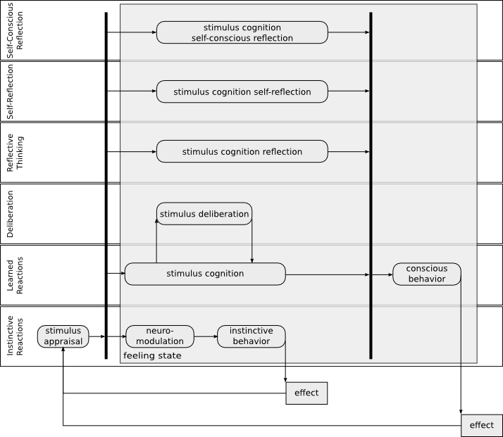

# Computational emotional thinking model

## Introduction

_TBD_

Marvin Minsky in his book "The emotion machine"[emotion_machine] described human thinking model.
He demonstrated that emotions are inseparable parts of thinking. There are several number of researchers that share this point of view on emotions. Rosalind Picard in her article[challenges] "Challenges of affective programming" states: "Although people are the most intelligent systems we know, and people’s emotion appears to play a vital role in regulating and guiding intelligence, it does not mean there might not be a better way to implement some of these goals in machines. It may be possible that there is something like the wheel, which has no precise human or animal equivalent, but which provides for some of the same locomotion goals. There may exist a kind of alien intelligent living system, something we’ve never encountered, which achieves its intelligence without having anything like emotion."

_TBD_

## Emotional thinking model

### Model basis

#### Minsky's Thinking model

First basis that is used in this work is  computer science. We used Marvin Minsky emotional thinking approach.
Marvin Minsky in his book "The emotion machine"[emotion_machine] described human thinking model. Main structural idea that we used and adopted is "Model of six".

Model of six thinking levels:

1. Instinctive reactions
1. Learned reactions
1. Deliberative
1. Reflective thinking
1. Self-reflective thinking
1. Self-conscious reflections

All thinking processes are developed in levels listed above. We use following assumption: emotions as part of thinking, at least conscious processes take , should fit thinking model. This way all emotional processed should be expressed in terms of thinking model(levels). This could be understood as base of computational emotional thinking approach.

#### Evolutionary psychology

The other perspective is psychology.  We use Plutchik approach[nature_of_emotion] as main psychological model. Plutchik indicated 8 basic emotions grouped in 4 pairs:

1. Joy - sorrow
1. Anger - fear
1. Acceptance - disgust
1. Surprise - expectancy

Emotions are organised in three dimensional circumplex model where third dimension is emotional strength. Basic emotions could be mixed based on color theory, in high-level, more complex emotions. Complex emotions based on two original are called "primary dyads":

1. Love
1. Submission
1. Awe
1. Disapproval
1. Remorse
1. Contempt
1. Aggressiveness
1. Optimism

More complex emotions based on three could be combined in similar way, see Cambria [sentic_computing].
Cambria [hourglass_of_emotions] used Gauss function to describe passage from a sentic level to another. We interpreted it as: Gaussian function regulates influence of subjective human perception of inbound stimulus over objective brain response. Semir Zeki[Neural_Correlates_of_Hate] describes neural activities correlation to emotion(hate) as Gaussian.

#### Neuromodulation theory

Third basis of emotional thinking model is neuroscience. Objective brain work is described as neuromodulation process in Fellous(1999) and Arbib & Fellous (2004) with base of four neuromodulatory systems:

1. Dopamine
1. Serotonin
1. Opioids

Close to their work is model based on monoamine neurotransmitters called "Cube of emotions" of Hugo Lövheim[Cube_of_emotions].
Author describes emotions and correlation to neurotransmitters concentration. Using only three main neurotransmitters:

1. Nor-adrenaline
1. Dopamine
1. Serotonin

Lövheim uses three dimensional model-cube and assumes that all emotional states could be placed in the three dimensional cube with neurotransmitters as axes and eight basic emotions ordered in ordered in an orthogonal coordinate system that are affective states that are inherited from affect theory of Tomkins (Tomkins (1962); Tomkins (1963); Tomkins (1991); Tomkins (1981)):

Positive:
 1. Enjoyment/Joy
 1. Interest/Excitement
 1. Surprise
 1. Anger/Rage
 1. Disgust
 1. Distress/Anguish
 1. Fear/Terror
 1. Shame/Humiliation

This group of affects does match the basic Plutchik's emotions except for humiliation that could be interpreted as contempt. Complete mapping description is presented below.

According to Arbib et al(2004) there are four following neuronal systems involved in to emotional processing:

1. Spinal cord
1. Hypothalamus
1. Amygdala
1. Frontal cortex, cingulate cortex

We correspond spinal cord, hypothalamus and amygdala with instinctive layer of Minsky's thinking model. This mapping is done in the assumption that reflexes, drives and instincts could be placed in instinctive reactions layer responsible for most primitive actions that do not involve conscious reactions or more complex processes like learned reactions or deliberations. Cognitions are could be placed in 5 higher layers that corresponds to working memory and all conscious actions in emotional processing/thinking.

### Emotions in six thinking levels

This is attempt to synthesize theory based on three approaches. First of all we described Plutchik's feedback loops[nature_of_emotion] in Minsky's six thinking levels.

Figure 1. [Emotions in model of six thinking levels].

1. Inbound stimulus is been processed(transmitted/apprised) via spinal cord, hypothalamus, amygdala and all these neuronal systems take part in neuromodulation.
1. Neuromodulation actually triggers the emotional state of human and all the rest actions are done under the influence of neuromodulatory systems: nor-adrenaline, dopamine, serotonin.
1. Instinctive behavior is processed on instinctive reactions layer that usually is not involved in conscious actions.
1. Result of behavior actions is effect state that influences the system again as stimulus. This second stimulus is been apprised on instinctive reactions layer and triggers neuromodulation again. Neuromodulation in it's turn switches emotional state second time. This way stimulus cognition actions started in first emotional state, at some point could continue in second emotional state.
1. Stimulus cognition is processed in cingulate cortex, frontal cortex (working memory) that we correspond to rest 5 layers of thinking model. Stimulus cognition actions is done in the emotional state under influence of neuromodulation and hormons. Stimulus cognition could involve deliberation, further reflection, sef-reflection self-conscious processing (higher emotions) and  emotional state switch.
1. Conscious behavior is activated as the result of stimulus cognition.

#### Stimulus appraisal and stimulus cognition

There are two main ways of inbound stimulus processing: appraisal is done on the instinctive reactions level and usually is processed as unconscious action, cognition could involve all the rest thinking levels and could consist of complex deliberations and reflections.
Cognitions also include self-conscious reflections over complex emotions like love, awe and aggression. For example startle is been apprised on instinctive reactions layer (spinal cord, hypothalamus, amygdala) where unconscious decision is made and instinctive behaviour is chosen (it could be even reflex). In case of startle this could be run or jump aside. Only after those instinctive actions are performed human could realise what had happen to him (in the state of effect). In contrast to appraisal cognitions could are performed on higher levels could take some significant time and could include complex reasoning and reflections. For example fear could be triggered not only by inbound stimulus but by long time perception during some horror movie or deliberation over some facts regarding the world. In contrast to startle fear triggers complex conscious behaviour that could in it's turn become panic and trigger less intelligent behaviour like shouting and running from side to side. Both instinctive and conscious behaviour produces effect state. Effect is an environmental state that was altered from previous state via behaviour. Running in case of startle places human in safe place that produces effect which influence stimulus event and it's appraisal and as consequence emotional/affective state.

#### Neuromodulation

#### Feeling the state

#### Higher emotions

#### Neuromodulation to computer system management mapping

#### Conformity with Picard criteria

## Conclusion

## References

Author, A. A. (2005). Title of work. Location/City, State: Publisher.

Arbib, M.A., & Fellous J. M. (2004). Emotions: from brain to robot. Trends in Cognitive Sciences, 8(12), 554-559
Fellous, J.M. (1999) Neuromodulatory basis of emotion. The Neuro-scientist 5, 283–294
Tomkins, S. (1962). Affect imagery consciousness volume I the positive affects. New York: Springer Publishing Company.
Tomkins, S. (1963). Affect imagery consciousness volume II the negative affects. New York: Springer Publishing Company.
Tomkins, S. (1991). Affect imagery consciousness volume III the negative affects anger and fear. New York: Springer Publishing Company.
Tomkins, S. (1981). The quest for primary motives: biography and autobiography of an idea. J Pers Soc Psychol, 41, 306–335.
